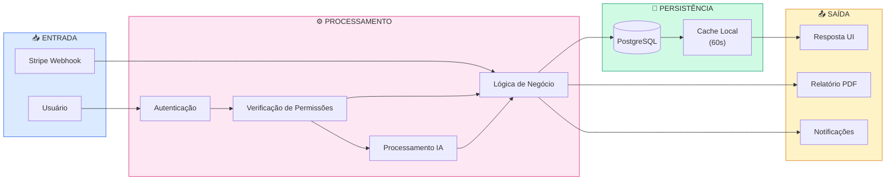
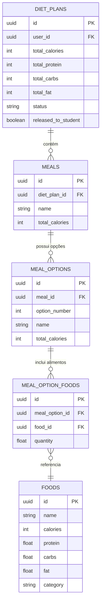
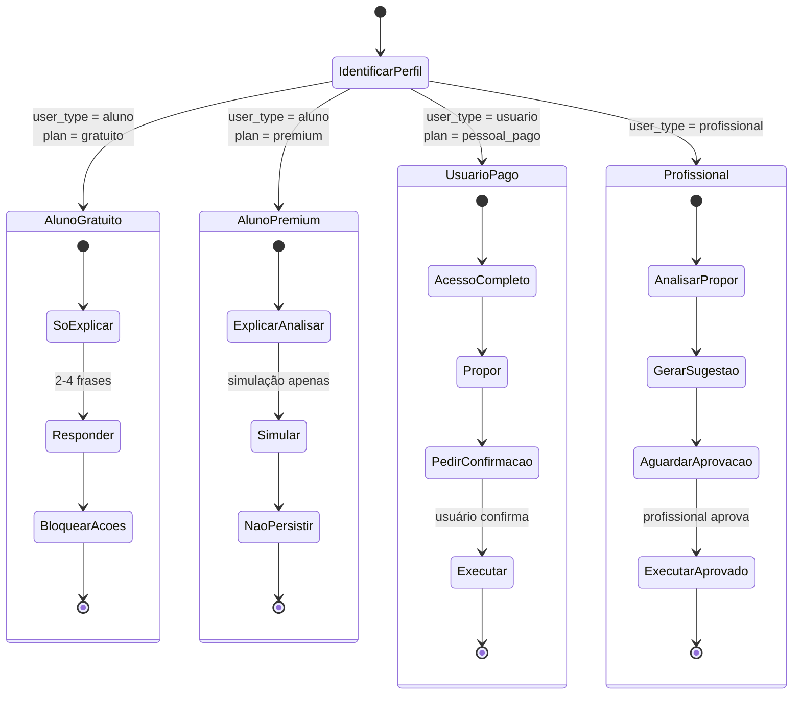

# DOCUMENTAÇÃO TÉCNICA OFICIAL — NUTRIAPLAN

## Versão do Documento: 1.1
## Data de Geração: 18 de Janeiro de 2026
## Última Atualização: 18 de Janeiro de 2026

---

# 📑 SUMÁRIO NAVEGÁVEL

## Visão Geral
- [1. Visão Técnica Geral do Sistema](#1-visão-técnica-geral-do-sistema)
  - [1.1 Propósito Técnico](#11-propósito-técnico)
  - [1.2 Características Principais](#12-características-principais)
- [2. Objetivo do Produto sob a Ótica Técnica](#2-objetivo-do-produto-sob-a-ótica-técnica)
  - [2.1 Problemas Técnicos Resolvidos](#21-problemas-técnicos-resolvidos)
  - [2.2 Escopo Técnico](#22-escopo-técnico)

## Arquitetura e Stack
- [3. Arquitetura Geral](#3-arquitetura-geral)
  - [3.1 Arquitetura em Camadas](#31-arquitetura-em-camadas)
  - [3.2 Componentes Principais](#32-componentes-principais)
  - [3.3 Diagrama de Arquitetura (Mermaid)](#33-diagrama-de-arquitetura-mermaid)
- [4. Stack Tecnológica](#4-stack-tecnológica)
  - [4.1 Frontend](#41-frontend)
  - [4.2 Backend](#42-backend)
  - [4.3 Integrações](#43-integrações)
  - [4.4 Infraestrutura](#44-infraestrutura)

## Usuários e Permissões
- [5. Tipos de Usuário e Papéis do Sistema](#5-tipos-de-usuário-e-papéis-do-sistema)
  - [5.1 Tipos de Usuário (user_type)](#51-tipos-de-usuário-user_type---imutável)
  - [5.2 Papéis do Sistema (app_role)](#52-papéis-do-sistema-app_role)
  - [5.3 Planos Comerciais](#53-planos-comerciais-commercialplan)
  - [5.4 Matriz de Permissões](#54-matriz-de-permissões)
  - [5.5 Restrições por Perfil](#55-restrições-por-perfil)

## Regras de Negócio
- [6. Regras de Negócio Detalhadas](#6-regras-de-negócio-detalhadas)
  - [6.1 Estrutura de Planos Alimentares](#61-estrutura-de-planos-alimentares)
  - [6.2 Fluxo de Confirmação de Refeições](#62-fluxo-de-confirmação-de-refeições)
  - [6.3 Cálculo de Adesão](#63-cálculo-de-adesão)
  - [6.4 Alertas de Adesão](#64-alertas-de-adesão)
  - [6.5 Geração de Planos via IA](#65-geração-de-planos-via-ia)
  - [6.6 Limites de Uso](#66-limites-de-uso)
  - [6.7 Solicitações de Alunos](#67-solicitações-de-alunos)

## Fluxos Técnicos
- [7. Fluxos Técnicos do Sistema](#7-fluxos-técnicos-do-sistema)
  - [7.1 Fluxo de Cadastro](#71-fluxo-de-cadastro)
  - [7.2 Fluxo de Login](#72-fluxo-de-login)
  - [7.3 Fluxo de Geração de Plano Alimentar](#73-fluxo-de-geração-de-plano-alimentar)
  - [7.4 Fluxo de Atualização de Plano (MacroRebalancer)](#74-fluxo-de-atualização-de-plano-macrorebalancer)
  - [7.5 Fluxo de Substituição de Alimentos](#75-fluxo-de-substituição-de-alimentos)
  - [7.6 Fluxo de Histórico e Progresso](#76-fluxo-de-histórico-e-progresso)
  - [7.7 Fluxo de Chat Nutricional](#77-fluxo-de-chat-nutricional)
  - [7.8 Fluxo de Solicitações (Student Requests)](#78-fluxo-de-solicitações-student-requests)

## Inteligência Artificial
- [8. Funcionamento da IA](#8-funcionamento-da-ia)
  - [8.1 Arquitetura da IA](#81-arquitetura-da-ia)
  - [8.2 Governança da IA por Perfil](#82-governança-da-ia-por-perfil)
  - [8.3 Limitações e Guardrails](#83-limitações-e-guardrails)
  - [8.4 Serviços Internos](#84-serviços-internos)

## Banco de Dados
- [9. Persistência de Dados](#9-persistência-de-dados)
  - [9.1 O Que É Salvo no Banco](#91-o-que-é-salvo-no-banco)
  - [9.2 O Que NÃO Deve Ser Salvo](#92-o-que-não-deve-ser-salvo)
  - [9.3 Estratégia de Histórico](#93-estratégia-de-histórico)
- [10. Estrutura Conceitual do Banco de Dados](#10-estrutura-conceitual-do-banco-de-dados)
  - [10.1 Diagrama ER Simplificado](#101-diagrama-er-simplificado)
  - [10.2 Tabelas Principais](#102-tabelas-principais)
  - [10.3 Enums do Banco](#103-enums-do-banco)
  - [10.4 Funções RPC Principais](#104-funções-rpc-principais)

## Integrações
- [11. Integrações Externas](#11-integrações-externas)
  - [11.1 Stripe](#111-stripe)
  - [11.2 Lovable AI Gateway](#112-lovable-ai-gateway)

## Requisitos
- [12. Requisitos Funcionais](#12-requisitos-funcionais)
  - [12.1 Autenticação e Autorização](#121-autenticação-e-autorização)
  - [12.2 Onboarding](#122-onboarding)
  - [12.3 Planos Alimentares](#123-planos-alimentares)
  - [12.4 Confirmação de Refeições](#124-confirmação-de-refeições)
  - [12.5 Adesão e Métricas](#125-adesão-e-métricas)
  - [12.6 Chat Nutricional](#126-chat-nutricional)
  - [12.7 Gerenciamento de Alunos](#127-gerenciamento-de-alunos-profissionais)
  - [12.8 Solicitações de Alunos](#128-solicitações-de-alunos)
  - [12.9 Progresso e Histórico](#129-progresso-e-histórico)
  - [12.10 Assinaturas e Pagamentos](#1210-assinaturas-e-pagamentos)
- [13. Requisitos Não Funcionais](#13-requisitos-não-funcionais)
  - [13.1 Performance](#131-performance)
  - [13.2 Segurança](#132-segurança)
  - [13.3 Escalabilidade](#133-escalabilidade)
  - [13.4 Disponibilidade](#134-disponibilidade)
  - [13.5 Usabilidade](#135-usabilidade)
  - [13.6 Manutenibilidade](#136-manutenibilidade)

## Diagnóstico e Evolução
- [14. Erros Conhecidos e Pontos Críticos](#14-erros-conhecidos-e-pontos-críticos)
  - [14.1 Erros Conhecidos](#141-erros-conhecidos)
  - [14.2 Pontos Críticos](#142-pontos-críticos)
- [15. Decisões Técnicas Já Tomadas](#15-decisões-técnicas-já-tomadas)
  - [15.1 Arquiteturais](#151-arquiteturais)
  - [15.2 Banco de Dados](#152-banco-de-dados)
  - [15.3 Negócio](#153-negócio)
  - [15.4 UX](#154-ux)
- [16. Riscos Técnicos e Limitações Atuais](#16-riscos-técnicos-e-limitações-atuais)
  - [16.1 Riscos Técnicos](#161-riscos-técnicos)
  - [16.2 Limitações Atuais](#162-limitações-atuais)
- [17. Boas Práticas e Padrões Adotados](#17-boas-práticas-e-padrões-adotados)
- [18. Próximos Passos Técnicos Sugeridos](#18-próximos-passos-técnicos-sugeridos)
  - [18.1 Curto Prazo (1-2 meses)](#181-curto-prazo-1-2-meses)
  - [18.2 Médio Prazo (3-6 meses)](#182-médio-prazo-3-6-meses)
  - [18.3 Longo Prazo (6-12 meses)](#183-longo-prazo-6-12-meses)

## Apêndices
- [A. Categorias de Alimentos](#a-categorias-de-alimentos)
- [B. Níveis de Processamento](#b-níveis-de-processamento)
- [C. Tipos de Refeição](#c-tipos-de-refeição)
- [D. Fórmula de Mifflin-St Jeor](#d-fórmula-de-mifflin-st-jeor)
- [E. Ajuste Calórico por Objetivo](#e-ajuste-calórico-por-objetivo)

---

# 1. VISÃO TÉCNICA GERAL DO SISTEMA

O NutriaPlan é uma plataforma web de nutrição inteligente que combina automação de planos alimentares via Inteligência Artificial com rastreamento de adesão, sistema de governança clínica e monetização via assinaturas Stripe.

## 1.1 Propósito Técnico

O sistema foi projetado para:
- Automatizar a criação de planos alimentares personalizados usando IA generativa
- Gerenciar relacionamentos profissional-aluno com controle de acesso granular
- Rastrear adesão alimentar com métricas calculadas automaticamente
- Fornecer assistente nutricional conversacional com governança por perfil
- Monetizar através de modelo de assinaturas com múltiplos planos comerciais

## 1.2 Características Principais

- **Multi-tenant por design**: Profissionais gerenciam seus próprios alunos
- **Governança de IA**: A IA opera com permissões diferenciadas por tipo de usuário
- **Modelo hierárquico de planos alimentares**: diet_plans → meals → meal_options → meal_option_foods
- **Sistema de confirmação de refeições**: Não é escolha, é confirmação do consumo real
- **Equivalência nutricional obrigatória**: Opções de refeição devem ser equivalentes dentro de margens definidas

---

# 2. OBJETIVO DO PRODUTO SOB A ÓTICA TÉCNICA

## 2.1 Problemas Técnicos Resolvidos

1. **Automação de cálculos nutricionais complexos**
   - Fórmula de Mifflin-St Jeor para cálculo de TMB
   - Distribuição automática de calorias por refeição
   - Seleção inteligente de alimentos por categoria e objetivo

2. **Governança de IA em contexto clínico**
   - Prevenção de alterações não autorizadas em planos
   - Diferenciação de permissões por perfil de usuário
   - Auditoria de propostas de alteração

3. **Rastreamento de adesão alimentar**
   - Cálculo automático de métricas de adesão
   - Alertas configuráveis para profissionais
   - Relatórios PDF sob demanda

## 2.2 Escopo Técnico

- **Frontend**: Single Page Application (SPA) React
- **Backend**: Supabase (PostgreSQL + Edge Functions + Auth)
- **IA**: Lovable AI Gateway (Google Gemini / OpenAI GPT-5)
- **Pagamentos**: Stripe (webhooks, checkout, portal do cliente)

---

# 3. ARQUITETURA GERAL

## 3.1 Arquitetura em Camadas

```
┌──────────────────────────────────────────────────────────────┐
│                    CAMADA DE APRESENTAÇÃO                      │
│  React 18.3 + Vite + TailwindCSS + shadcn/ui + Framer Motion  │
├──────────────────────────────────────────────────────────────┤
│                      CAMADA DE ESTADO                          │
│        TanStack Query + React Context (AuthContext)           │
├──────────────────────────────────────────────────────────────┤
│                    CAMADA DE SERVIÇOS                          │
│              Supabase Client (supabase-js)                     │
├──────────────────────────────────────────────────────────────┤
│                  CAMADA DE BACKEND                             │
│  Supabase Edge Functions (Deno) + PostgreSQL + RLS Policies   │
├──────────────────────────────────────────────────────────────┤
│                  CAMADA DE INTEGRAÇÕES                         │
│     Lovable AI Gateway + Stripe API + Supabase Auth           │
└──────────────────────────────────────────────────────────────┘
```

## 3.3 Diagrama de Arquitetura (Mermaid)

```mermaid
flowchart TB
    subgraph Cliente["🖥️ CLIENTE (Browser)"]
        React["React 18.3 SPA"]
        TQ["TanStack Query"]
        Auth["AuthContext"]
        UI["shadcn/ui + Tailwind"]
    end

    subgraph Backend["☁️ LOVABLE CLOUD / SUPABASE"]
        subgraph EdgeFunctions["Edge Functions (Deno)"]
            GMP["generate-meal-plan"]
            NC["nutritional-chat"]
            CM["confirm-meal"]
            CS["create-student"]
            CC["create-checkout"]
            SW["stripe-webhook"]
            AR["adherence-report"]
            APS["ai-plan-suggestions"]
        end
        
        subgraph Database["PostgreSQL + RLS"]
            Profiles["profiles"]
            DietPlans["diet_plans"]
            Meals["meals"]
            MealOptions["meal_options"]
            Foods["foods"]
            DailyLogs["daily_logs"]
            Subscriptions["subscriptions"]
            ChatMessages["chat_messages"]
        end
        
        SupaAuth["Supabase Auth"]
        Storage["Supabase Storage"]
    end

    subgraph External["🔗 INTEGRAÇÕES EXTERNAS"]
        LovableAI["Lovable AI Gateway<br/>Gemini / GPT-5"]
        Stripe["Stripe API<br/>Pagamentos"]
    end

    React --> TQ
    TQ --> Auth
    React --> UI
    
    TQ <-->|"supabase-js"| EdgeFunctions
    TQ <-->|"supabase-js"| Database
    TQ <-->|"supabase-js"| SupaAuth
    
    GMP -->|"API Call"| LovableAI
    NC -->|"API Call"| LovableAI
    APS -->|"API Call"| LovableAI
    
    CC -->|"Checkout Session"| Stripe
    SW <-->|"Webhooks"| Stripe
    
    EdgeFunctions --> Database
    SupaAuth --> Profiles

    style Cliente fill:#e0f2fe,stroke:#0284c7
    style Backend fill:#dcfce7,stroke:#16a34a
    style External fill:#fef3c7,stroke:#d97706
```



## 3.4 Diagrama de Fluxo de Dados



## 3.5 Diagrama de Hierarquia de Planos Alimentares



## 3.6 Fluxo de Governança da IA



## 3.2 Componentes Principais

### 3.2.1 Frontend (React SPA)
- **Páginas**: Dashboard, MealDetail, Chat, DailyLog, Progress, Profile, Students, ProfessionalDashboard, Onboarding, Pricing, Subscription
- **Componentes de UI**: shadcn/ui components (100% customizados)
- **Hooks Customizados**: useAccountPermissions, useCachedUserData, useSubscription, useUserRole, useLinkedStudent, useProfessionalStudents

### 3.2.2 Backend (Edge Functions)
- **generate-meal-plan**: Geração de planos alimentares via IA
- **generate-meal-plan-v2**: Versão avançada com opções equivalentes
- **nutritional-chat**: Chat conversacional com governança
- **confirm-meal**: Confirmação de consumo de refeições
- **create-checkout**: Criação de sessão Stripe Checkout
- **stripe-webhook**: Processamento de eventos Stripe
- **customer-portal**: Acesso ao portal do cliente Stripe
- **create-student**: Criação de alunos por profissionais
- **adherence-report**: Geração de relatórios de adesão
- **generate-adherence-pdf**: Geração de PDF de relatório
- **ai-plan-suggestions**: Sugestões de ajuste via IA
- **review-suggestion**: Revisão de sugestões de IA
- **check-adherence-alerts**: Verificação de alertas de adesão
- **validate-usage**: Validação de limites de uso
- **explain-substitution**: Explicação de substituições alimentares

### 3.2.3 Banco de Dados (PostgreSQL)
- 25+ tabelas principais
- Row Level Security (RLS) habilitado em todas as tabelas
- Funções RPC para operações complexas
- Triggers para automações

---

# 4. STACK TECNOLÓGICA

## 4.1 Frontend

| Tecnologia | Versão | Propósito |
|------------|--------|-----------|
| React | ^18.3.1 | Framework de UI |
| Vite | Latest | Build tool e dev server |
| TypeScript | Latest | Tipagem estática |
| TailwindCSS | Latest | Estilização utility-first |
| shadcn/ui | Latest | Componentes de UI |
| Framer Motion | ^12.26.2 | Animações |
| TanStack Query | ^5.83.0 | Gerenciamento de estado servidor |
| React Router DOM | ^6.30.1 | Roteamento |
| Recharts | ^2.15.4 | Gráficos |
| date-fns | ^3.6.0 | Manipulação de datas |
| Zod | ^3.25.76 | Validação de schemas |
| React Hook Form | ^7.61.1 | Gerenciamento de formulários |

## 4.2 Backend

| Tecnologia | Propósito |
|------------|-----------|
| Supabase | Backend-as-a-Service |
| PostgreSQL | Banco de dados relacional |
| Deno | Runtime para Edge Functions |
| Supabase Auth | Autenticação |
| Supabase Storage | Armazenamento de arquivos |
| Supabase Realtime | (Preparado, não implementado) |

## 4.3 Integrações

| Serviço | Propósito |
|---------|-----------|
| Lovable AI Gateway | IA generativa (Gemini/GPT-5) |
| Stripe | Pagamentos e assinaturas |

## 4.4 Infraestrutura

| Componente | Descrição |
|------------|-----------|
| Lovable Cloud | Hospedagem frontend e gerenciamento Supabase |
| Supabase Cloud | PostgreSQL, Auth, Edge Functions, Storage |
| Stripe | Processamento de pagamentos |

---

# 5. TIPOS DE USUÁRIO E PAPÉIS DO SISTEMA

## 5.1 Tipos de Usuário (user_type - IMUTÁVEL)

O campo `user_type` na tabela `profiles` define o tipo imutável do usuário:

| user_type | Descrição |
|-----------|-----------|
| `aluno` | Usuário vinculado a um profissional |
| `usuario` | Usuário autônomo (pessoa física) |
| `profissional` | Nutricionista ou profissional de saúde |

## 5.2 Papéis do Sistema (app_role)

A tabela `user_roles` armazena os papéis de forma segura:

| Role | Descrição |
|------|-----------|
| `admin` | Administrador do sistema |
| `professional` | Profissional de nutrição |
| `student` | Aluno vinculado |

## 5.3 Planos Comerciais (CommercialPlan)

| Plano | Tipo | Preço/mês | Descrição |
|-------|------|-----------|-----------|
| `gratuito` | personal | R$ 0,00 | IA educacional básica |
| `premium` | personal | R$ 4,90 | IA educacional ampliada (alunos vinculados) |
| `plano_pessoal_pago` | personal | R$ 14,90 | IA completa com autonomia |
| `profissional` | professional | R$ 99,00 | IA como assistente clínica |

## 5.4 Matriz de Permissões

### 5.4.1 Permissões por Plano

| Permissão | Gratuito | Premium | Pessoal Pago | Profissional |
|-----------|----------|---------|--------------|--------------|
| can_view_plan | ✓ | ✓ | ✓ | ✓ |
| can_create_plan | ✗ | ✗ | ✓ | ✓ |
| can_edit_plan | ✗ | ✗ | ✓ | ✓ |
| can_substitute | ✗ | ✗ | ✓ | ✓ |
| can_adjust | ✗ | ✗ | ✓ | ✓ |
| can_use_ai | ✓ (básica) | ✓ (ampliada) | ✓ (completa) | ✓ (clínica) |
| can_use_simulations | ✗ | ✓ | ✓ | ✓ |
| can_manage_students | ✗ | ✗ | ✗ | ✓ |
| can_send_requests | ✓ (aluno) | ✓ (aluno) | ✗ | ✗ |

### 5.4.2 Limites por Plano

| Limite | Gratuito | Premium | Pessoal Pago | Profissional |
|--------|----------|---------|--------------|--------------|
| Dietas/mês | 0 | 0 | 5 | ∞ |
| Substituições/mês | 0 | 0 | 20 | ∞ |
| Ajustes/mês | 0 | 0 | 10 | ∞ |
| Mensagens chat/dia | 3 | 10 | 30 | 100 |
| Pacientes | 0 | 0 | 0 | 50 |
| Histórico (dias) | 7 | 30 | 90 | 9999 |

## 5.5 Restrições por Perfil

### 5.5.1 Aluno Vinculado (is_linked_to_professional = true)
- **NÃO PODE**: Criar, editar, substituir ou ajustar planos
- **PODE**: Visualizar plano, confirmar refeições, usar chat (educacional), enviar solicitações ao profissional
- **MODO**: Somente leitura no plano alimentar

### 5.5.2 Aluno + Premium
- Mesmas restrições do aluno gratuito
- Chat educacional ampliado (10 mensagens/dia)
- Pode usar simulações (sem persistir)
- Histórico estendido (30 dias)

### 5.5.3 Usuário Pessoal Pago
- Autonomia total sobre seu próprio plano
- IA pode propor E executar alterações (com confirmação)
- Sem vínculo com profissional

### 5.5.4 Profissional
- Gerencia múltiplos alunos
- IA propõe alterações, profissional aprova
- Pode criar/editar planos de alunos
- Recebe alertas de adesão

---

# 6. REGRAS DE NEGÓCIO DETALHADAS

## 6.1 Estrutura de Planos Alimentares

### 6.1.1 Hierarquia Obrigatória

```
diet_plans (plano)
  └── meals (refeições)
        └── meal_options (opções de refeição)
              └── meal_option_foods (alimentos da opção)
                    └── foods (cadastro de alimentos)
```

### 6.1.2 Equivalência Nutricional Entre Opções

Todas as opções de uma mesma refeição DEVEM ser equivalentes dentro das margens:

| Nutriente | Margem de Tolerância |
|-----------|---------------------|
| Proteína | ±5g |
| Carboidratos | ±10g |
| Gordura | ±3g |
| Calorias | ±10% |

### 6.1.3 Validação de Equivalência

A função `validateEquivalence` no Edge Function `generate-meal-plan-v2` valida que todas as opções respeitam as margens definidas.

## 6.2 Fluxo de Confirmação de Refeições

### 6.2.1 Princípio Fundamental

O plano é SOMENTE LEITURA. O usuário NÃO ESCOLHE o que vai comer. O usuário CONFIRMA o que COMEU.

### 6.2.2 Estados Válidos por Refeição (meal_logs.status)

| Estado | Descrição |
|--------|-----------|
| `PENDENTE` | Refeição ainda não registrada |
| `CONFIRMADA` | Usuário confirmou que comeu uma das opções |
| `PULADA` | Usuário pulou a refeição (não comeu nada) |
| `FORA_DO_PLANO` | Usuário comeu algo diferente do plano |
| `CONFIRMADA_TARDIA` | Confirmação feita em data retroativa |

### 6.2.3 Regras de Confirmação

1. Confirmar para o dia atual = status `CONFIRMADA`
2. Confirmar para dia passado = status `CONFIRMADA_TARDIA`
3. Pular refeição = status `PULADA`
4. Comer fora do plano = status `FORA_DO_PLANO` + notas opcionais
5. Não é permitido confirmar para datas futuras

## 6.3 Cálculo de Adesão

### 6.3.1 Fórmula de Adesão Geral

```
overall_adherence_rate = (meals_confirmed + meals_late_confirmed) / total_meals_expected * 100
```

### 6.3.2 Métricas Calculadas (adherence_metrics)

- `meals_confirmed`: Refeições confirmadas no dia
- `meals_late_confirmed`: Confirmações tardias
- `meals_skipped`: Refeições puladas
- `meals_out_of_plan`: Refeições fora do plano
- `days_with_records`: Dias com pelo menos 1 registro
- `adherence_by_meal`: Adesão por tipo de refeição (JSON)
- `adherence_by_option`: Preferência por opções (JSON)
- `exception_distribution`: Distribuição de exceções (JSON)

## 6.4 Alertas de Adesão

### 6.4.1 Configuração (adherence_alert_configs)

Profissionais podem configurar:
- `threshold_warning`: Limite para alerta amarelo (default: 70%)
- `threshold_low`: Limite para alerta vermelho (default: 50%)
- `check_period_days`: Período de verificação (default: 7 dias)
- `notify_on_warning`: Notificar em alertas amarelos
- `notify_on_low`: Notificar em alertas vermelhos

### 6.4.2 Geração de Alertas

O Edge Function `check-adherence-alerts` (executado periodicamente) verifica todos os alunos de cada profissional e cria alertas na tabela `adherence_alerts`.

## 6.5 Geração de Planos via IA

### 6.5.1 Seleção Inteligente de Alimentos

A função `selectFoodsIntelligently`:
1. Filtra alimentos por nível de processamento (apenas `in_natura` e `minimamente_processado`)
2. Remove suplementos
3. Aplica restrições alimentares do usuário
4. Pontua alimentos por:
   - Densidade de macros ajustada ao objetivo
   - Preferências do usuário
   - Diversidade de categorias
5. Seleciona até 80 alimentos diversos

### 6.5.2 Distribuição de Calorias por Refeição

| Refeições/dia | Café | Lanche AM | Almoço | Lanche PM | Jantar | Ceia |
|---------------|------|-----------|--------|-----------|--------|------|
| 2 | - | - | 50% | - | 50% | - |
| 3 | 25% | - | 40% | - | 35% | - |
| 4 | 25% | - | 35% | 10% | 30% | - |
| 5 | 20% | 10% | 30% | 10% | 30% | - |
| 6 | 20% | 8% | 28% | 10% | 26% | 8% |

### 6.5.3 Prioridade de Categorias por Refeição

```javascript
breakfast: ['cereais_tubérculos', 'frutas', 'laticínios', 'óleos_oleaginosas']
morning_snack: ['frutas', 'óleos_oleaginosas', 'laticínios']
lunch: ['proteínas_animais', 'cereais_tubérculos', 'leguminosas', 'hortaliças_folhosas', 'legumes']
afternoon_snack: ['frutas', 'laticínios', 'óleos_oleaginosas']
dinner: ['proteínas_animais', 'hortaliças_folhosas', 'legumes', 'cereais_tubérculos']
supper: ['laticínios', 'frutas', 'óleos_oleaginosas']
```

## 6.6 Limites de Uso

### 6.6.1 Função can_use_feature

Verifica se o usuário pode usar determinada funcionalidade:

```sql
can_use_feature(_user_id UUID, _feature TEXT) RETURNS BOOLEAN
```

Features suportadas:
- `diet`: Geração de planos
- `substitution`: Substituição de alimentos
- `adjustment`: Ajustes de macros
- `chat`: Mensagens do chat

### 6.6.2 Função increment_usage

Incrementa o uso de uma feature após uso bem-sucedido:

```sql
increment_usage(_user_id UUID, _feature TEXT) RETURNS BOOLEAN
```

### 6.6.3 Reset de Uso

- **Diário**: `chat_messages_today` reseta à meia-noite (last_chat_reset)
- **Mensal**: Outros contadores resetam no início de cada período de assinatura

## 6.7 Solicitações de Alunos

### 6.7.1 Tipos de Solicitação (student_requests)

| Tipo | Descrição |
|------|-----------|
| `goal_change` | Alteração de objetivo (perda, manutenção, ganho) |
| `meals_change` | Alteração no número de refeições |
| `food_substitution` | Substituição de alimento específico |

### 6.7.2 Status de Solicitação

| Status | Descrição |
|--------|-----------|
| `pending` | Aguardando resposta do profissional |
| `approved` | Aprovada pelo profissional |
| `rejected` | Rejeitada pelo profissional |

### 6.7.3 Campos Opcionais

- `professional_response`: Resposta/comentário do profissional
- `professional_feedback`: Feedback adicional

---

# 7. FLUXOS TÉCNICOS DO SISTEMA

## 7.1 Fluxo de Cadastro

```
1. Usuário acessa /signup
2. Preenche email e senha
3. Supabase Auth cria usuário
4. Trigger cria registro em profiles (onboarding_completed = false)
5. Redirect para /onboarding
6. Usuário preenche dados pessoais (idade, sexo, altura, peso)
7. Usuário seleciona objetivo (lose_weight, maintain, gain_muscle)
8. Usuário seleciona nível de atividade
9. Usuário seleciona número de refeições (2-6)
10. Usuário seleciona preferências e restrições
11. Sistema calcula targets via Mifflin-St Jeor
12. Profile atualizado com targets
13. Se não profissional: Edge Function generate-meal-plan gera plano inicial
14. weight_logs recebe peso inicial
15. Redirect para /dashboard
```

## 7.2 Fluxo de Login

```
1. Usuário acessa /login
2. Preenche email e senha
3. Supabase Auth valida credenciais
4. AuthContext recebe user e carrega profile
5. Se must_change_password = true: redireciona para alteração
6. Se onboarding_completed = false: redireciona para /onboarding
7. Se profissional e professional_onboarding_completed = false: ProfessionalOnboarding
8. Caso contrário: redireciona para /dashboard
```

## 7.3 Fluxo de Geração de Plano Alimentar

```
1. Usuário clica "Gerar plano alimentar" ou "Gerar novo plano"
2. Frontend verifica permissões via useAccountPermissions
3. Se aluno vinculado: mostra diálogo de solicitação
4. Se sem permissão: mostra upgrade dialog
5. Com permissão: chama supabase.functions.invoke('generate-meal-plan')
6. Edge Function:
   a. Valida autenticação
   b. Verifica can_create_plan (exceto para isInitialPlan)
   c. Verifica can_use_feature('diet')
   d. Se studentId: verifica vínculo profissional-aluno
   e. Carrega alimentos do banco
   f. Seleciona alimentos inteligentemente
   g. Chama Lovable AI Gateway com prompt estruturado
   h. Parseia resposta JSON
   i. Cria diet_plan
   j. Cria meals
   k. Cria meal_foods
   l. Registra em plan_history
   m. Incrementa usage
7. Frontend atualiza estado e exibe plano
```

## 7.4 Fluxo de Atualização de Plano (MacroRebalancer)

```
1. Usuário ajusta sliders de macros no MacroRebalancer
2. Ao confirmar, chama hook useMacroRebalancer
3. MacroRebalancerService.rebalance():
   a. Cria snapshot do plano atual (plan_versions)
   b. Ajusta quantidades de alimentos proporcionalmente
   c. Recalcula totais de cada meal
   d. Atualiza meal_option_foods
   e. Atualiza meal_options
   f. Atualiza meals
   g. Atualiza diet_plan
   h. Registra em plan_history
4. Frontend recarrega plano
```

## 7.5 Fluxo de Substituição de Alimentos

```
1. Usuário clica em alimento para substituir (MealDetail)
2. Sistema busca alimentos da mesma categoria
3. Filtra por equivalência nutricional
4. Usuário seleciona substituto
5. Chama Edge Function explain-substitution (opcional)
6. Atualiza meal_option_foods
7. Recalcula totais
8. Registra em plan_history
```

## 7.6 Fluxo de Histórico e Progresso

```
1. Usuário acessa /progress
2. Sistema busca get_user_plan para obter history_days
3. Busca weight_logs dos últimos N dias
4. Busca plan_history dos últimos N dias
5. Calcula:
   - Peso atual vs inicial
   - Variação semanal
   - Tendência
6. Renderiza gráfico e histórico
```

## 7.7 Fluxo de Chat Nutricional

```
1. Usuário acessa /chat
2. Carrega histórico de mensagens (chat_messages)
3. Verifica limite via check_feature_limit
4. Usuário envia mensagem
5. Frontend salva mensagem do usuário
6. Chama supabase.functions.invoke('nutritional-chat')
7. Edge Function:
   a. Valida autenticação
   b. Verifica limite de mensagens
   c. Carrega histórico (sliding window de 20 mensagens)
   d. Se histórico > 15: resume mensagens antigas
   e. Monta system prompt baseado em perfil
   f. Chama Lovable AI Gateway
   g. Persiste resposta
   h. Incrementa usage
   i. Retorna resposta + usage atualizado
8. Frontend exibe resposta
9. Se limite atingido: exibe banner de upgrade
```

## 7.8 Fluxo de Solicitações (Student Requests)

```
1. Aluno vinculado clica "Fazer solicitação"
2. Diálogo abre com tipos de solicitação
3. Aluno seleciona tipo, descreve e justifica
4. Chama supabase insert em student_requests
5. Profissional vê solicitações no painel
6. Profissional pode aprovar/rejeitar com feedback
7. Aluno pode ver status da solicitação
```

---

# 8. FUNCIONAMENTO DA IA

## 8.1 Arquitetura da IA

### 8.1.1 Gateway Utilizado

- **Endpoint**: https://ai.gateway.lovable.dev/v1/chat/completions
- **Modelos Suportados**:
  - google/gemini-3-flash-preview (padrão)
  - google/gemini-2.5-flash
  - google/gemini-2.5-pro
  - openai/gpt-5

### 8.1.2 Autenticação

- API Key: `LOVABLE_API_KEY` (provisionada automaticamente)
- Nunca exposta no cliente
- Usada apenas em Edge Functions

## 8.2 Governança da IA por Perfil

### 8.2.1 Princípios de Governança

```
A IA NÃO é autônoma.
A IA NÃO toma decisões finais.
Toda alteração real passa pelo backend.
A IA pode PROPOR, mas não EXECUTAR sem autorização.
```

### 8.2.2 Perfis de Governança

#### ALUNO + GRATUITO
- **Verbos Permitidos**: EXPLICAR, ORIENTAR
- **Verbos Proibidos**: ANALISAR macros, SIMULAR, PROPOR, EXECUTAR
- **Limite de Frases**: 2-4 frases padrão
- **Bloqueio**: "Não posso alterar seu plano alimentar. Posso ajudar a criar uma solicitação ao seu profissional."

#### ALUNO + PREMIUM
- **Verbos Permitidos**: EXPLICAR, ANALISAR (leitura), SIMULAR
- **Verbos Proibidos**: EXECUTAR, alterar plano oficial
- **Limite de Frases**: 4-6 frases padrão
- **Simulações**: Rotuladas como simulação, sem impacto real
- **Bloqueio**: "Para alterações no seu plano, converse com seu nutricionista."

#### USUÁRIO + PLANO_PESSOAL_PAGO
- **Verbos Permitidos**: EXPLICAR, ANALISAR, SIMULAR, PROPOR, EXECUTAR
- **Limite de Frases**: 5-8 frases padrão
- **Execução**: Requer confirmação explícita do usuário
- **Capacidades**: Criar/editar planos, ajustar macros, sugerir substituições

#### PROFISSIONAL
- **Verbos Permitidos**: EXPLICAR, ANALISAR, SIMULAR, PROPOR
- **Execução**: Somente após aprovação explícita do profissional
- **Fluxo Obrigatório**: IA PROPÕE → Profissional aprova → Sistema executa
- **Limite de Frases**: 6-10 frases padrão
- **Estilo**: Técnico, analítico, conciso

### 8.2.3 Gatilhos de Expansão

A IA só pode ultrapassar limites de frases se detectar:
- "explique melhor"
- "detalhe"
- "aprofundar"
- "por quê?"
- "quero entender mais"

Após gatilho: pode dobrar limite, máximo 20 frases.

## 8.3 Limitações e Guardrails

### 8.3.1 Limitações Técnicas

1. **Rate Limit**: Limite de requisições por minuto por workspace
2. **Token Limit**: Contexto máximo por requisição
3. **Créditos**: Consumo baseado em uso, com limites mensais

### 8.3.2 Guardrails de Segurança

1. **Nunca persistir dados diretamente**: Toda persistência via backend validado
2. **Nunca ignorar vínculo profissional**: Verificação obrigatória em todas as operações
3. **Nunca fechar calorias/macros autonomamente**: Sempre requer confirmação
4. **Sempre verificar permissões**: Baseado em user_type e plan_name
5. **Bloquear em caso de dúvida**: Explicar motivo e oferecer próximo passo

### 8.3.3 Formato de Proposta de Ajuste

```json
{
  "action": "update_diet_plan",
  "target_student": "email@aluno.com",
  "adjustment_type": "food_substitution | portion_adjustment | macro_redistribution",
  "summary": "Descrição clara e curta do ajuste",
  "strategy": "onde e como compensar",
  "requires_approval": true
}
```

## 8.4 Serviços Internos

### 8.4.1 MacroRebalancerService

- **Propósito**: Rebalancear macros de um plano existente
- **Entrada**: planId, targets atuais, novos targets
- **Processo**:
  1. Snapshot do estado atual
  2. Cálculo de proporções de ajuste
  3. Aplicação proporcional em todos os alimentos
  4. Validação de limites mínimos
  5. Persistência

### 8.4.2 Summarization Service

- **Propósito**: Resumir histórico de conversas longas
- **Threshold**: Histórico > 15 mensagens
- **Modelo**: gemini-2.5-flash-lite (mais rápido)
- **Limite**: Resumo máximo de 500 caracteres

### 8.4.3 Equivalence Validation

- **Propósito**: Validar equivalência nutricional entre opções
- **Margens**: Proteína ±5g, Carbs ±10g, Fat ±3g, Cal ±10%
- **Retorno**: { valid: boolean, errors: string[] }

---

# 9. PERSISTÊNCIA DE DADOS

## 9.1 O Que É Salvo no Banco

### 9.1.1 Dados Persistidos

| Dado | Tabela | Observação |
|------|--------|------------|
| Perfil do usuário | profiles | Dados pessoais, targets, preferências |
| Planos alimentares | diet_plans | Status, totais, vínculo com usuário |
| Refeições | meals | Nome, totais por refeição |
| Opções de refeição | meal_options | Opções equivalentes por refeição |
| Alimentos das opções | meal_option_foods | Quantidade e vínculo com foods |
| Cadastro de alimentos | foods | Base de dados nutricional |
| Logs diários | daily_logs | Status e totais por dia |
| Logs de refeição | meal_logs | Status individual por refeição |
| Histórico de alterações | plan_history | Ações, valores anteriores/novos |
| Versões de plano | plan_versions | Snapshots completos para rollback |
| Métricas de adesão | adherence_metrics | Cálculos consolidados |
| Alertas de adesão | adherence_alerts | Alertas para profissionais |
| Mensagens de chat | chat_messages | Histórico completo |
| Solicitações de alunos | student_requests | Pedidos e respostas |
| Vínculos profissional-aluno | professional_students | Status do vínculo |
| Licenças profissionais | professional_licenses | Limites e validade |
| Assinaturas | subscriptions | Status, ciclo, provider IDs |
| Uso mensal | user_usage | Contadores de features |
| Logs de peso | weight_logs | Histórico de pesagens |
| Relatórios de adesão | adherence_report_files | Referências aos PDFs |
| Sugestões de IA | ai_suggestions | Propostas pendentes/revisadas |
| Eventos de webhook | webhook_events | Idempotência Stripe |
| Audit log | admin_audit_log | Ações administrativas |
| Configurações | system_settings | Parâmetros do sistema |

### 9.1.2 Dados de Sessão (NÃO persistidos)

- Estado de UI (modais abertos, abas selecionadas)
- Cache local de permissões (60 segundos)
- Mensagem sendo digitada no chat
- Opção selecionada temporariamente

## 9.2 O Que NÃO Deve Ser Salvo

1. **Senhas em texto plano**: Gerenciadas pelo Supabase Auth
2. **Tokens de sessão**: Gerenciados pelo Supabase Auth
3. **Chaves de API externas no banco**: Usar Secrets
4. **Dados de cartão de crédito**: Gerenciados pelo Stripe
5. **Respostas temporárias da IA**: Antes de confirmação

## 9.3 Estratégia de Histórico

### 9.3.1 Histórico por Plano

| Plano | Histórico (dias) |
|-------|------------------|
| Gratuito | 7 |
| Premium | 30 |
| Pessoal Pago | 90 |
| Profissional | 9999 (ilimitado) |

### 9.3.2 Dados Sujeitos a Limite de Histórico

- weight_logs
- plan_history
- (Potencialmente daily_logs, meal_logs em versões futuras)

### 9.3.3 Limpeza de Dados

Atualmente NÃO há limpeza automática. Dados antigos permanecem no banco, mas são filtrados nas queries baseado em history_days.

**Inferência**: Uma rotina de limpeza pode ser implementada futuramente para otimização.

---

# 10. ESTRUTURA CONCEITUAL DO BANCO DE DADOS

## 10.1 Diagrama ER Simplificado

```
┌──────────────┐     ┌──────────────┐     ┌──────────────┐
│   profiles   │────<│ diet_plans   │────<│    meals     │
└──────────────┘     └──────────────┘     └──────────────┘
       │                    │                    │
       │                    │                    ├────<┌──────────────┐
       │                    │                    │     │ meal_options │
       │                    │                    │     └──────────────┘
       │                    │                    │            │
       │                    │                    │            ├────<┌──────────────────┐
       │                    │                    │            │     │ meal_option_foods│
       │                    │                    │            │     └──────────────────┘
       │                    │                    │            │            │
       │                    │                    │            │            v
       │                    │                    │            │     ┌──────────────┐
       │                    │                    │            │     │    foods     │
       │                    │                    │            │     └──────────────┘
       │                    │                    │
       │              ┌─────┴──────┐            │
       │              │            │            │
       │              v            v            v
       │     ┌──────────────┐ ┌──────────────┐ ┌──────────────┐
       │     │ plan_history │ │plan_versions │ │  meal_foods  │
       │     └──────────────┘ └──────────────┘ └──────────────┘
       │
       ├────<┌──────────────┐
       │     │ daily_logs   │────<┌──────────────┐
       │     └──────────────┘     │  meal_logs   │
       │                          └──────────────┘
       │
       ├────<┌──────────────┐
       │     │ weight_logs  │
       │     └──────────────┘
       │
       ├────<┌──────────────────┐
       │     │ chat_messages    │
       │     └──────────────────┘
       │
       ├────<┌──────────────────┐
       │     │ subscriptions    │────>┌──────────────┐
       │     └──────────────────┘     │    plans     │
       │                              └──────────────┘
       │
       ├────<┌──────────────────┐
       │     │   user_usage     │
       │     └──────────────────┘
       │
       ├────<┌──────────────────┐
       │     │   user_roles     │
       │     └──────────────────┘
       │
       ├────<┌────────────────────────┐
       │     │ professional_students  │
       │     └────────────────────────┘
       │              │
       │              v
       │     ┌──────────────────┐
       └────>│  (outro profile) │
             └──────────────────┘
```

## 10.2 Tabelas Principais

### 10.2.1 profiles
- **PK**: id (UUID)
- **FK**: user_id → auth.users
- **FK**: professional_id → profiles (self-reference)
- **Campos principais**: name, email, age, sex, height, weight, goal, activity_level, preferences, restrictions, daily_calories, protein_target, carbs_target, fat_target, meals_per_day, account_type, user_type, onboarding_completed

### 10.2.2 diet_plans
- **PK**: id (UUID)
- **FK**: user_id → auth.users
- **Campos principais**: total_calories, total_protein, total_carbs, total_fat, status, released_to_student, is_initial_plan

### 10.2.3 meals
- **PK**: id (UUID)
- **FK**: diet_plan_id → diet_plans
- **Campos principais**: name, total_calories, total_protein, total_carbs, total_fat

### 10.2.4 meal_options
- **PK**: id (UUID)
- **FK**: meal_id → meals
- **Campos principais**: option_number, name, total_calories, total_protein, total_carbs, total_fat

### 10.2.5 meal_option_foods
- **PK**: id (UUID)
- **FK**: meal_option_id → meal_options
- **FK**: food_id → foods
- **Campos principais**: quantity

### 10.2.6 foods
- **PK**: id (UUID)
- **Campos principais**: name, calories, protein, carbs, fat, serving_size, category, processing_level

### 10.2.7 daily_logs
- **PK**: id (UUID)
- **FK**: user_id → auth.users
- **FK**: diet_plan_id → diet_plans
- **Campos principais**: log_date, status, plan_version, total_*_consumed

### 10.2.8 meal_logs
- **PK**: id (UUID)
- **FK**: daily_log_id → daily_logs
- **FK**: meal_id → meals
- **FK**: confirmed_option_id → meal_options
- **Campos principais**: status, confirmed_at, notes, *_consumed

## 10.3 Enums do Banco

```sql
account_type: 'aluno' | 'plano_pessoal' | 'premium' | 'profissional'
app_role: 'admin' | 'professional' | 'student'
billing_cycle: 'monthly' | 'quarterly' | 'semiannual' | 'annual'
plan_type: 'personal' | 'professional'
plan_type_commercial: 'gratuito' | 'plano_pessoal_pago' | 'premium' | 'profissional'
subscription_status: 'trial' | 'active' | 'past_due' | 'canceled' | 'expired'
user_type: 'aluno' | 'usuario' | 'profissional'
```

## 10.4 Funções RPC Principais

| Função | Propósito |
|--------|-----------|
| `get_user_permissions` | Retorna todas as permissões do usuário |
| `get_user_plan` | Retorna informações do plano e limites |
| `can_use_feature` | Verifica se pode usar feature |
| `can_create_plan` | Verifica se pode criar plano |
| `can_edit_plan` | Verifica se pode editar plano |
| `check_feature_limit` | Retorna limite e uso atual |
| `increment_usage` | Incrementa contador de uso |
| `reset_monthly_usage` | Reseta contadores mensais |
| `has_role` | Verifica se usuário tem determinado role |
| `has_active_license` | Verifica licença profissional ativa |
| `get_student_access_level` | Retorna nível de acesso do aluno |
| `get_professional_subscription_state` | Estado da assinatura do profissional |
| `get_student_count` | Conta alunos de um profissional |
| `calculate_adherence_metrics` | Calcula métricas de adesão |
| `confirm_meal_consumption` | Confirma consumo de refeição |
| `user_owns_meal` | Verifica propriedade de refeição |
| `user_owns_meal_option` | Verifica propriedade de opção |
| `professional_manages_meal` | Verifica se profissional gerencia refeição |
| `professional_manages_meal_option` | Verifica se profissional gerencia opção |

---

# 11. INTEGRAÇÕES EXTERNAS

## 11.1 Stripe

### 11.1.1 Configuração

- **Secrets necessários**:
  - `STRIPE_SECRET_KEY`: Chave secreta do Stripe
  - `STRIPE_WEBHOOK_SECRET`: Secret para validação de webhooks

### 11.1.2 Endpoints Utilizados

| Endpoint | Propósito |
|----------|-----------|
| POST /v1/checkout/sessions | Criar sessão de checkout |
| POST /v1/billing_portal/sessions | Criar sessão do portal |
| GET /v1/customers | Buscar cliente por email |
| POST /v1/customers | Criar cliente |
| Webhook events | Processar eventos assíncronos |

### 11.1.3 Eventos de Webhook Processados

| Evento | Ação |
|--------|------|
| `checkout.session.completed` | Ativar assinatura, resetar uso |
| `customer.subscription.updated` | Atualizar status, grace period |
| `customer.subscription.deleted` | Cancelar/downgrade para gratuito |
| `invoice.payment_failed` | Entrar em grace period |
| `invoice.payment_succeeded` | Reativar assinatura |

### 11.1.4 Grace Period

- Duração: 7 dias
- Status durante grace: `past_due`
- Após expiração: `canceled`
- Profissionais: `suspended` (mantém vínculo com alunos)

### 11.1.5 Ciclo de Cobrança

Atualmente **apenas mensal** (`monthly`). Outros ciclos (quarterly, semiannual, annual) estão definidos no banco mas não implementados na UI.

### 11.1.6 Fluxo de Checkout

```
1. Usuário seleciona plano em /pricing
2. Frontend chama create-checkout com planId
3. Edge Function:
   a. Valida autenticação
   b. Busca plano no banco
   c. Verifica assinatura existente
   d. Busca/cria customer no Stripe
   e. Cria checkout session com metadata (user_id, plan_id)
   f. Retorna URL
4. Frontend redireciona para Stripe
5. Usuário paga
6. Webhook checkout.session.completed recebido
7. Assinatura ativada no banco
8. Redirect para /dashboard?checkout=success
```

## 11.2 Lovable AI Gateway

### 11.2.1 Configuração

- **Endpoint**: https://ai.gateway.lovable.dev/v1/chat/completions
- **Secret**: `LOVABLE_API_KEY` (auto-provisionado)

### 11.2.2 Uso no Sistema

| Edge Function | Modelo Usado | Propósito |
|---------------|--------------|-----------|
| generate-meal-plan | gemini-3-flash-preview | Gerar planos |
| nutritional-chat | gemini-3-flash-preview | Chat conversacional |
| explain-substitution | gemini-2.5-flash | Explicar substituições |
| ai-plan-suggestions | gemini-2.5-flash | Sugerir ajustes |
| (summarization) | gemini-2.5-flash-lite | Resumir histórico |

### 11.2.3 Rate Limits e Erros

| Status | Significado | Ação |
|--------|-------------|------|
| 429 | Rate limit exceeded | Aguardar e retry |
| 402 | Payment required (créditos) | Adicionar créditos |
| 500 | Erro interno | Retry com backoff |

---

# 12. REQUISITOS FUNCIONAIS

## 12.1 Autenticação e Autorização

- **RF01**: O sistema deve permitir cadastro com email e senha
- **RF02**: O sistema deve permitir login com email e senha
- **RF03**: O sistema deve suportar recuperação de senha por email
- **RF04**: O sistema deve verificar permissões em todas as operações
- **RF05**: O sistema deve diferenciar acesso por tipo de usuário e plano

## 12.2 Onboarding

- **RF06**: O sistema deve coletar dados pessoais (idade, sexo, altura, peso)
- **RF07**: O sistema deve coletar objetivo nutricional
- **RF08**: O sistema deve coletar nível de atividade física
- **RF09**: O sistema deve permitir seleção de número de refeições (2-6)
- **RF10**: O sistema deve permitir seleção de preferências alimentares
- **RF11**: O sistema deve permitir seleção de restrições alimentares
- **RF12**: O sistema deve calcular metas calóricas e de macros automaticamente
- **RF13**: O sistema deve gerar plano inicial automaticamente (exceto profissionais)

## 12.3 Planos Alimentares

- **RF14**: O sistema deve gerar planos com múltiplas opções por refeição
- **RF15**: O sistema deve garantir equivalência nutricional entre opções
- **RF16**: O sistema deve respeitar preferências e restrições do usuário
- **RF17**: O sistema deve permitir visualização detalhada de refeições
- **RF18**: O sistema deve permitir ajuste de macros (usuários autorizados)
- **RF19**: O sistema deve permitir substituição de alimentos (usuários autorizados)
- **RF20**: O sistema deve manter histórico de alterações

## 12.4 Confirmação de Refeições

- **RF21**: O sistema deve permitir confirmação de refeições do dia
- **RF22**: O sistema deve permitir confirmação retroativa (marcada como tardia)
- **RF23**: O sistema deve permitir registro de refeições puladas
- **RF24**: O sistema deve permitir registro de refeições fora do plano
- **RF25**: O sistema deve exibir progresso diário

## 12.5 Adesão e Métricas

- **RF26**: O sistema deve calcular taxa de adesão geral
- **RF27**: O sistema deve calcular adesão por tipo de refeição
- **RF28**: O sistema deve calcular distribuição de exceções
- **RF29**: O sistema deve gerar alertas para profissionais
- **RF30**: O sistema deve permitir configuração de thresholds de alerta
- **RF31**: O sistema deve gerar relatórios PDF de adesão

## 12.6 Chat Nutricional

- **RF32**: O sistema deve fornecer assistente de IA conversacional
- **RF33**: O sistema deve diferenciar capacidades por perfil de usuário
- **RF34**: O sistema deve limitar mensagens diárias por plano
- **RF35**: O sistema deve manter histórico de conversas
- **RF36**: O sistema deve resumir histórico longo automaticamente

## 12.7 Gerenciamento de Alunos (Profissionais)

- **RF37**: O sistema deve permitir criação de alunos
- **RF38**: O sistema deve permitir vinculação de alunos existentes
- **RF39**: O sistema deve permitir visualização de planos de alunos
- **RF40**: O sistema deve permitir criação de planos para alunos
- **RF41**: O sistema deve exibir alertas de adesão de alunos
- **RF42**: O sistema deve permitir liberação de plano para aluno

## 12.8 Solicitações de Alunos

- **RF43**: O sistema deve permitir que alunos enviem solicitações
- **RF44**: O sistema deve exibir solicitações para profissionais
- **RF45**: O sistema deve permitir aprovação/rejeição com feedback

## 12.9 Progresso e Histórico

- **RF46**: O sistema deve permitir registro de peso
- **RF47**: O sistema deve exibir gráfico de evolução de peso
- **RF48**: O sistema deve exibir histórico de alterações no plano
- **RF49**: O sistema deve limitar histórico por plano comercial

## 12.10 Assinaturas e Pagamentos

- **RF50**: O sistema deve exibir planos disponíveis com preços
- **RF51**: O sistema deve processar pagamentos via Stripe
- **RF52**: O sistema deve ativar assinatura após pagamento
- **RF53**: O sistema deve gerenciar ciclo de vida da assinatura
- **RF54**: O sistema deve fornecer portal do cliente Stripe
- **RF55**: O sistema deve aplicar grace period em falhas de pagamento

---

# 13. REQUISITOS NÃO FUNCIONAIS

## 13.1 Performance

- **RNF01**: Tempo de resposta da API < 2 segundos para operações comuns
- **RNF02**: Geração de plano alimentar < 30 segundos
- **RNF03**: Resposta do chat < 10 segundos
- **RNF04**: Cache de permissões por 60 segundos para reduzir queries
- **RNF05**: Limite de 1000 rows por query no Supabase

## 13.2 Segurança

- **RNF06**: RLS habilitado em todas as tabelas
- **RNF07**: Funções SECURITY DEFINER para operações privilegiadas
- **RNF08**: Validação de webhook signature do Stripe
- **RNF09**: Secrets nunca expostos no cliente
- **RNF10**: Rate limiting em Edge Functions (2 segundos entre mensagens de chat)
- **RNF11**: Validação de input em todas as Edge Functions
- **RNF12**: Roles armazenados em tabela separada (prevenção de escalação)
- **RNF13**: Verificação de idempotência em webhooks

## 13.3 Escalabilidade

- **RNF14**: Arquitetura serverless (Edge Functions escalam automaticamente)
- **RNF15**: Banco de dados gerenciado (Supabase/PostgreSQL)
- **RNF16**: Sem estado no servidor (stateless)
- **RNF17**: Suporte a múltiplos profissionais com múltiplos alunos

## 13.4 Disponibilidade

- **RNF18**: Uptime dependente de Lovable Cloud e Supabase
- **RNF19**: Retry automático em falhas de pagamento (Stripe)
- **RNF20**: Grace period de 7 dias para manter acesso

## 13.5 Usabilidade

- **RNF21**: Design responsivo (mobile-first)
- **RNF22**: Suporte a tema dark/light
- **RNF23**: Animações suaves (Framer Motion)
- **RNF24**: Feedback visual em todas as ações
- **RNF25**: Mensagens de erro claras

## 13.6 Manutenibilidade

- **RNF26**: Código TypeScript tipado
- **RNF27**: Componentes reutilizáveis (shadcn/ui)
- **RNF28**: Hooks customizados para lógica compartilhada
- **RNF29**: Migrations versionadas
- **RNF30**: Logs estruturados em Edge Functions

---

# 14. ERROS CONHECIDOS E PONTOS CRÍTICOS

## 14.1 Erros Conhecidos

### 14.1.1 Timeouts de Conexão
- **Descrição**: Queries complexas podem causar timeout no tier Pico
- **Causa**: Limite de 60 conexões no pool do tier Pico
- **Mitigação**: Cache de 60s, otimização de queries, índices
- **Solução definitiva**: Upgrade de instância

### 14.1.2 RLS Recursivo
- **Descrição**: Políticas RLS que referenciam outras tabelas podem causar recursão
- **Mitigação**: Uso de SECURITY DEFINER em funções helper
- **Status**: Parcialmente resolvido com funções como `has_role`, `user_owns_meal`

## 14.2 Pontos Críticos

### 14.2.1 Dependência de IA Externa
- **Risco**: Indisponibilidade do Lovable AI Gateway
- **Impacto**: Geração de planos e chat não funcionam
- **Mitigação**: Tratamento de erros adequado, fallbacks amigáveis

### 14.2.2 Limites de Créditos de IA
- **Risco**: Usuários esgotam créditos do workspace
- **Impacto**: Erro 402 nas funcionalidades de IA
- **Mitigação**: Mensagens claras, monitoramento de uso

### 14.2.3 Webhook Reliability
- **Risco**: Webhooks Stripe podem falhar ou atrasar
- **Impacto**: Assinaturas não ativadas/atualizadas corretamente
- **Mitigação**: Idempotência, reconciliação periódica

---

# 15. DECISÕES TÉCNICAS JÁ TOMADAS

## 15.1 Arquiteturais

1. **Lovable Cloud vs Supabase Direto**: Escolhido Lovable Cloud pela facilidade de integração
2. **Edge Functions vs API Própria**: Escolhido Edge Functions para serverless puro
3. **Lovable AI vs OpenAI Direto**: Escolhido Lovable AI pelo LOVABLE_API_KEY auto-provisionado

## 15.2 Banco de Dados

1. **Roles em tabela separada**: Prevenção de escalação de privilégios
2. **RLS em todas as tabelas**: Segurança por design
3. **Funções SECURITY DEFINER**: Evitar recursão em RLS
4. **Índices compostos**: Otimização de queries com RLS

## 15.3 Negócio

1. **Ciclo mensal apenas**: Simplificação inicial (outros ciclos preparados mas não ativados)
2. **Grace period de 7 dias**: Balanceamento entre retenção e inadimplência
3. **Plano Premium exclusivo para alunos vinculados**: Diferenciação de ofertas
4. **Chat governado por perfil**: Segurança e adequação clínica

## 15.4 UX

1. **Confirmação vs Escolha**: Plano é read-only, usuário confirma o que comeu
2. **Equivalência nutricional**: Liberdade de escolha sem comprometer resultados
3. **Bloqueio com sugestão**: Quando bloqueado, sempre oferecer próximo passo

---

# 16. RISCOS TÉCNICOS E LIMITAÇÕES ATUAIS

## 16.1 Riscos Técnicos

| Risco | Probabilidade | Impacto | Mitigação |
|-------|---------------|---------|-----------|
| Timeout de banco | Alta | Médio | Cache, índices, upgrade |
| Rate limit IA | Média | Médio | Rate limiting no chat |
| Falha webhook Stripe | Baixa | Alto | Idempotência, reconciliação |
| Esgotamento de créditos IA | Média | Alto | Monitoramento, limites por usuário |

## 16.2 Limitações Atuais

1. **Sem realtime**: Atualizações não são em tempo real
2. **Sem PWA/Offline**: Requer conexão para funcionar
3. **Sem push notifications**: Alertas apenas no sistema
4. **Sem integração com wearables**: Dados manuais apenas
5. **Sem multi-idioma**: Apenas português brasileiro
6. **Sem histórico ilimitado para todos**: Limitado por plano
7. **Sem API pública**: Sem integrações externas

---

# 17. BOAS PRÁTICAS E PADRÕES ADOTADOS

## 17.1 Código

- TypeScript strict mode
- ESLint configurado
- Componentes funcionais com hooks
- Custom hooks para lógica reutilizável
- Separação de concerns (pages, components, hooks, lib)

## 17.2 Banco de Dados

- Migrations versionadas
- RLS em todas as tabelas
- Índices para queries frequentes
- Funções RPC para lógica complexa
- Triggers para automações

## 17.3 Segurança

- Secrets gerenciados fora do código
- Validação de input em Edge Functions
- Rate limiting em endpoints sensíveis
- Verificação de permissões em todas as operações
- Auditoria de ações administrativas

## 17.4 UX/UI

- Design responsivo (mobile-first)
- Feedback visual em ações
- Estados de loading
- Tratamento de erros amigável
- Animações suaves

---

# 18. PRÓXIMOS PASSOS TÉCNICOS SUGERIDOS

## 18.1 Curto Prazo (1-2 meses)

1. **Upgrade de instância Supabase**: Resolver timeouts
2. **Implementar reconciliação de assinaturas**: Edge Function periódica
3. **Adicionar testes automatizados**: Jest/Vitest para componentes críticos
4. **Otimizar queries de adesão**: Índices e views materializadas

## 18.2 Médio Prazo (3-6 meses)

1. **PWA/Offline**: Service worker para funcionalidade offline básica
2. **Push Notifications**: Alertas de adesão via push
3. **Realtime**: Atualizações em tempo real para profissionais
4. **Multi-idioma**: i18n para expansão internacional
5. **API Pública**: Integrações com terceiros

## 18.3 Longo Prazo (6-12 meses)

1. **App Nativo**: React Native para iOS/Android
2. **Integração Wearables**: Apple Health, Google Fit
3. **IA mais avançada**: Análise preditiva de adesão
4. **White-label**: Versão para clínicas personalizarem
5. **Marketplace de planos**: Profissionais vendem planos prontos

---

# APÊNDICES

## A. Categorias de Alimentos

```
frutas
hortaliças_folhosas
legumes
cereais_tubérculos
leguminosas
proteínas_animais
laticínios
óleos_oleaginosas
suplementos
```

## B. Níveis de Processamento

```
in_natura
minimamente_processado
processado
ultraprocessado
suplemento
```

## C. Tipos de Refeição

```
breakfast      - Café da Manhã
morning_snack  - Lanche da Manhã
lunch          - Almoço
afternoon_snack - Lanche da Tarde
dinner         - Jantar
supper         - Ceia
```

## D. Fórmula de Mifflin-St Jeor

**Homens**:
```
TMB = 10 × peso(kg) + 6.25 × altura(cm) - 5 × idade + 5
```

**Mulheres**:
```
TMB = 10 × peso(kg) + 6.25 × altura(cm) - 5 × idade - 161
```

**TDEE** = TMB × Multiplicador de Atividade

| Nível | Multiplicador |
|-------|---------------|
| Sedentário | 1.2 |
| Leve | 1.375 |
| Moderado | 1.55 |
| Ativo | 1.725 |
| Muito Ativo | 1.9 |

## E. Ajuste Calórico por Objetivo

| Objetivo | Ajuste |
|----------|--------|
| Perder peso | -500 kcal |
| Manter peso | 0 kcal |
| Ganhar massa | +300 kcal |

---

*Documento gerado automaticamente em 18 de Janeiro de 2026*
*Versão 1.0 - NutriaPlan*
