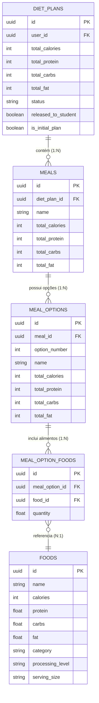
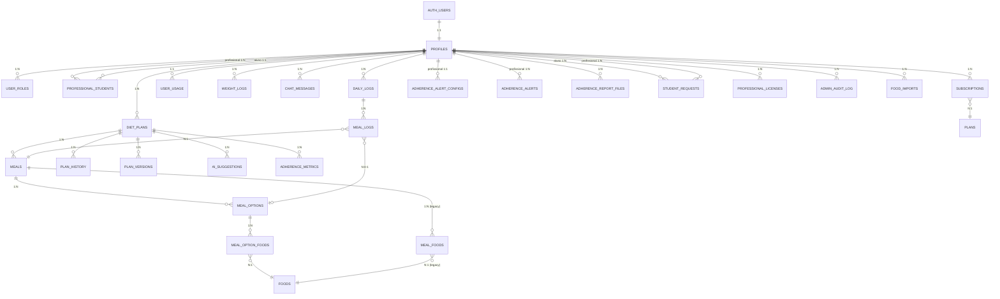

# DOCUMENTAÇÃO TÉCNICA OFICIAL — NUTRIAPLAN

## Versão do Documento: 2.2
## Data de Geração: 18 de Janeiro de 2026
## Última Atualização: 21 de Janeiro de 2026

---

## CHANGELOG

| Versão | Data | Alterações |
|--------|------|------------|
| 2.2 | 21/01/2026 | Incremento automático de uso de ajustes no rebalanceador de macros. Atualização de edge functions para contagem correta de features. Remoção de campos legados v1 (billing_cycle, account_type, user_type). Consolidação do esquema v2 com 13 tabelas principais. |
| 2.1 | 21/01/2026 | Correção do constraint `profiles_sex_check` para aceitar valores 'male', 'female', 'other'. Atualização pós-auditoria de banco de dados v2. |
| 2.0 | 18/01/2026 | Versão consolidada: adicionados fluxos completos por perfil (Admin, Profissional, Aluno), detalhamento de gestão de alimentos, estrutura completa do banco de dados com cardinalidades, aprofundamento da IA, seção de auditoria administrativa, edge functions recentes |
| 1.1 | 18/01/2026 | Versão inicial com estrutura base |

---

# 📑 SUMÁRIO NAVEGÁVEL

## Visão Geral
- [1. Visão Técnica Geral do Sistema](#1-visão-técnica-geral-do-sistema)
- [2. Objetivo do Produto sob a Ótica Técnica](#2-objetivo-do-produto-sob-a-ótica-técnica)

## Arquitetura e Stack
- [3. Arquitetura Geral](#3-arquitetura-geral)
- [4. Stack Tecnológica](#4-stack-tecnológica)

## Usuários e Permissões
- [5. Tipos de Usuário e Papéis do Sistema](#5-tipos-de-usuário-e-papéis-do-sistema)
- [6. Fluxos Completos por Perfil de Usuário](#6-fluxos-completos-por-perfil-de-usuário) *(NOVO)*

## Regras de Negócio
- [7. Regras de Negócio Detalhadas](#7-regras-de-negócio-detalhadas)

## Gestão de Alimentos
- [8. Gestão de Alimentos](#8-gestão-de-alimentos) *(NOVO/EXPANDIDO)*

## Fluxos Técnicos
- [9. Fluxos Técnicos do Sistema](#9-fluxos-técnicos-do-sistema)

## Inteligência Artificial
- [10. Funcionamento da IA](#10-funcionamento-da-ia) *(EXPANDIDO)*

## Banco de Dados
- [11. Estrutura Completa do Banco de Dados](#11-estrutura-completa-do-banco-de-dados) *(EXPANDIDO)*
- [12. Persistência de Dados](#12-persistência-de-dados)

## Integrações
- [13. Integrações Externas](#13-integrações-externas)

## Requisitos
- [14. Requisitos Funcionais](#14-requisitos-funcionais)
- [15. Requisitos Não Funcionais](#15-requisitos-não-funcionais)

## Administração
- [16. Painel Administrativo](#16-painel-administrativo) *(NOVO)*

## Diagnóstico e Evolução
- [17. Erros Conhecidos e Pontos Críticos](#17-erros-conhecidos-e-pontos-críticos)
- [18. Decisões Técnicas Já Tomadas](#18-decisões-técnicas-já-tomadas)
- [19. Riscos Técnicos e Limitações Atuais](#19-riscos-técnicos-e-limitações-atuais)
- [20. Boas Práticas e Padrões Adotados](#20-boas-práticas-e-padrões-adotados)
- [21. Próximos Passos Técnicos Sugeridos](#21-próximos-passos-técnicos-sugeridos)

## Apêndices
- [A. Categorias de Alimentos](#a-categorias-de-alimentos)
- [B. Níveis de Processamento](#b-níveis-de-processamento)
- [C. Tipos de Refeição](#c-tipos-de-refeição)
- [D. Fórmula de Mifflin-St Jeor](#d-fórmula-de-mifflin-st-jeor)
- [E. Ajuste Calórico por Objetivo](#e-ajuste-calórico-por-objetivo)
- [F. Glossário Técnico](#f-glossário-técnico) *(NOVO)*

---

# 1. VISÃO TÉCNICA GERAL DO SISTEMA

O NutriaPlan é uma plataforma web de nutrição inteligente que combina automação de planos alimentares via Inteligência Artificial com rastreamento de adesão, sistema de governança clínica e monetização via assinaturas Stripe.

## 1.1 Propósito Técnico

O sistema foi projetado para:
- Automatizar a criação de planos alimentares personalizados usando IA generativa
- Gerenciar relacionamentos profissional-aluno com controle de acesso granular
- Rastrear adesão alimentar com métricas calculadas automaticamente
- Fornecer assistente nutricional conversacional com governança por perfil
- Monetizar através de modelo de assinaturas com múltiplos planos comerciais

## 1.2 Características Principais

- **Multi-tenant por design**: Profissionais gerenciam seus próprios alunos
- **Governança de IA**: A IA opera com permissões diferenciadas por tipo de usuário
- **Modelo hierárquico de planos alimentares**: diet_plans → meals → meal_options → meal_option_foods
- **Sistema de confirmação de refeições**: Não é escolha, é confirmação do consumo real
- **Equivalência nutricional obrigatória**: Opções de refeição devem ser equivalentes dentro de margens definidas

---

# 2. OBJETIVO DO PRODUTO SOB A ÓTICA TÉCNICA

## 2.1 Problemas Técnicos Resolvidos

1. **Automação de cálculos nutricionais complexos**
   - Fórmula de Mifflin-St Jeor para cálculo de TMB
   - Distribuição automática de calorias por refeição
   - Seleção inteligente de alimentos por categoria e objetivo

2. **Governança de IA em contexto clínico**
   - Prevenção de alterações não autorizadas em planos
   - Diferenciação de permissões por perfil de usuário
   - Auditoria de propostas de alteração

3. **Rastreamento de adesão alimentar**
   - Cálculo automático de métricas de adesão
   - Alertas configuráveis para profissionais
   - Relatórios PDF sob demanda

## 2.2 Escopo Técnico

- **Frontend**: Single Page Application (SPA) React
- **Backend**: Supabase (PostgreSQL + Edge Functions + Auth)
- **IA**: Lovable AI Gateway (Google Gemini / OpenAI GPT-5)
- **Pagamentos**: Stripe (webhooks, checkout, portal do cliente)

---

# 3. ARQUITETURA GERAL

## 3.1 Arquitetura em Camadas

```
┌──────────────────────────────────────────────────────────────┐
│                    CAMADA DE APRESENTAÇÃO                      │
│  React 18.3 + Vite + TailwindCSS + shadcn/ui + Framer Motion  │
├──────────────────────────────────────────────────────────────┤
│                      CAMADA DE ESTADO                          │
│        TanStack Query + React Context (AuthContext)           │
├──────────────────────────────────────────────────────────────┤
│                    CAMADA DE SERVIÇOS                          │
│              Supabase Client (supabase-js)                     │
├──────────────────────────────────────────────────────────────┤
│                  CAMADA DE BACKEND                             │
│  Supabase Edge Functions (Deno) + PostgreSQL + RLS Policies   │
├──────────────────────────────────────────────────────────────┤
│                  CAMADA DE INTEGRAÇÕES                         │
│     Lovable AI Gateway + Stripe API + Supabase Auth           │
└──────────────────────────────────────────────────────────────┘
```

## 3.2 Componentes Principais

### 3.2.1 Frontend (React SPA)
- **Páginas**: Dashboard, MealDetail, Chat, DailyLog, Progress, Profile, Students, ProfessionalDashboard, Onboarding, Pricing, Subscription, Admin
- **Componentes de UI**: shadcn/ui components (100% customizados)
- **Hooks Customizados**: useAccountPermissions, useCachedUserData, useSubscription, useUserRole, useLinkedStudent, useProfessionalStudents, useAdminOperations

### 3.2.2 Backend (Edge Functions)

| Edge Function | Propósito |
|---------------|-----------|
| `generate-meal-plan` | Geração de planos alimentares via IA |
| `generate-meal-plan-v2` | Versão avançada com opções equivalentes |
| `nutritional-chat` | Chat conversacional com governança |
| `confirm-meal` | Confirmação de consumo de refeições |
| `create-checkout` | Criação de sessão Stripe Checkout |
| `stripe-webhook` | Processamento de eventos Stripe |
| `customer-portal` | Acesso ao portal do cliente Stripe |
| `create-student` | Criação de alunos por profissionais |
| `lookup-student` | Busca de alunos por email |
| `adherence-report` | Geração de relatórios de adesão |
| `generate-adherence-pdf` | Geração de PDF de relatório |
| `ai-plan-suggestions` | Sugestões de ajuste via IA |
| `review-suggestion` | Revisão de sugestões de IA |
| `check-adherence-alerts` | Verificação de alertas de adesão |
| `validate-usage` | Validação de limites de uso |
| `explain-substitution` | Explicação de substituições alimentares |
| `admin-operations` | Operações administrativas centralizadas |
| `seed-test-data` | Geração de dados de teste |
| `check-subscription` | Verificação de status de assinatura |
| `reconcile-subscriptions` | Reconciliação periódica com Stripe |
| `validate-email` | Validação de formato de email |
| `validate-food-import` | Validação de importação de alimentos via IA |
| `audit-foods` | Auditoria e normalização de alimentos via IA |
| `rebalance-meal-plan` | Rebalanceamento de macros com contagem de uso |
| `create-admin` | Criação de usuários administradores |
| `cleanup-orphan-users` | Limpeza de usuários órfãos no Auth |
| `delete-account` | Exclusão completa de conta de usuário |

### 3.2.3 Banco de Dados (PostgreSQL)
- 13 tabelas principais no esquema v2 consolidado
- Row Level Security (RLS) habilitado em todas as tabelas
- Funções RPC para operações complexas (confirm_meal_consumption, can_use_feature, increment_usage, get_user_plan)
- Triggers para automações e validações

## 3.3 Diagrama de Arquitetura (Mermaid)

```mermaid
flowchart TB
    subgraph Cliente["🖥️ CLIENTE (Browser)"]
        React["React 18.3 SPA"]
        TQ["TanStack Query"]
        Auth["AuthContext"]
        UI["shadcn/ui + Tailwind"]
    end

    subgraph Backend["☁️ LOVABLE CLOUD / SUPABASE"]
        subgraph EdgeFunctions["Edge Functions (Deno)"]
            GMP["generate-meal-plan"]
            NC["nutritional-chat"]
            CM["confirm-meal"]
            CS["create-student"]
            CC["create-checkout"]
            SW["stripe-webhook"]
            AR["adherence-report"]
            APS["ai-plan-suggestions"]
            AO["admin-operations"]
            VFI["validate-food-import"]
            AF["audit-foods"]
        end
        
        subgraph Database["PostgreSQL + RLS"]
            Profiles["profiles"]
            DietPlans["diet_plans"]
            Meals["meals"]
            MealOptions["meal_options"]
            Foods["foods"]
            DailyLogs["daily_logs"]
            Subscriptions["subscriptions"]
            ChatMessages["chat_messages"]
            AdminAudit["admin_audit_log"]
        end
        
        SupaAuth["Supabase Auth"]
        Storage["Supabase Storage"]
    end

    subgraph External["🔗 INTEGRAÇÕES EXTERNAS"]
        LovableAI["Lovable AI Gateway<br/>Gemini / GPT-5"]
        Stripe["Stripe API<br/>Pagamentos"]
    end

    React --> TQ
    TQ --> Auth
    React --> UI
    
    TQ <-->|"supabase-js"| EdgeFunctions
    TQ <-->|"supabase-js"| Database
    TQ <-->|"supabase-js"| SupaAuth
    
    GMP -->|"API Call"| LovableAI
    NC -->|"API Call"| LovableAI
    APS -->|"API Call"| LovableAI
    VFI -->|"API Call"| LovableAI
    AF -->|"API Call"| LovableAI
    
    CC -->|"Checkout Session"| Stripe
    SW <-->|"Webhooks"| Stripe
    
    EdgeFunctions --> Database
    SupaAuth --> Profiles
```



## 3.4 Diagrama de Hierarquia de Planos Alimentares



---

# 4. STACK TECNOLÓGICA

## 4.1 Frontend

| Tecnologia | Versão | Propósito |
|------------|--------|-----------|
| React | ^18.3.1 | Framework de UI |
| Vite | Latest | Build tool e dev server |
| TypeScript | Latest | Tipagem estática |
| TailwindCSS | Latest | Estilização utility-first |
| shadcn/ui | Latest | Componentes de UI |
| Framer Motion | ^12.26.2 | Animações |
| TanStack Query | ^5.83.0 | Gerenciamento de estado servidor |
| React Router DOM | ^6.30.1 | Roteamento |
| Recharts | ^2.15.4 | Gráficos |
| date-fns | ^3.6.0 | Manipulação de datas |
| Zod | ^3.25.76 | Validação de schemas |
| React Hook Form | ^7.61.1 | Gerenciamento de formulários |

## 4.2 Backend

| Tecnologia | Propósito |
|------------|-----------|
| Supabase | Backend-as-a-Service |
| PostgreSQL | Banco de dados relacional |
| Deno | Runtime para Edge Functions |
| Supabase Auth | Autenticação |
| Supabase Storage | Armazenamento de arquivos (relatórios PDF) |
| Supabase Realtime | (Preparado, não implementado) |

## 4.3 Integrações

| Serviço | Propósito |
|---------|-----------|
| Lovable AI Gateway | IA generativa (Gemini/GPT-5) |
| Stripe | Pagamentos e assinaturas |

## 4.4 Infraestrutura

| Componente | Descrição |
|------------|-----------|
| Lovable Cloud | Hospedagem frontend e gerenciamento Supabase |
| Supabase Cloud | PostgreSQL, Auth, Edge Functions, Storage |
| Stripe | Processamento de pagamentos |

---

# 5. TIPOS DE USUÁRIO E PAPÉIS DO SISTEMA

## 5.1 Tipos de Usuário (user_type - IMUTÁVEL)

O campo `user_type` na tabela `profiles` define o tipo imutável do usuário:

| user_type | Descrição |
|-----------|-----------|
| `aluno` | Usuário vinculado a um profissional |
| `usuario` | Usuário autônomo (pessoa física) |
| `profissional` | Nutricionista ou profissional de saúde |

## 5.2 Papéis do Sistema (app_role)

A tabela `user_roles` armazena os papéis de forma segura:

| Role | Descrição | Pode ser atribuído a |
|------|-----------|---------------------|
| `admin` | Administrador do sistema | Qualquer user_type |
| `professional` | Profissional de nutrição | user_type = profissional |
| `student` | Aluno vinculado | user_type = aluno |

**Regra de Segurança**: Roles são armazenados em tabela separada (`user_roles`) para prevenir escalação de privilégios via manipulação direta de `profiles`.

## 5.3 Planos Comerciais (CommercialPlan)

| Plano | Tipo | Preço/mês | Descrição |
|-------|------|-----------|-----------|
| `gratuito` | personal | R$ 0,00 | IA educacional básica |
| `premium` | personal | R$ 4,90 | IA educacional ampliada (alunos vinculados) |
| `plano_pessoal_pago` | personal | R$ 14,90 | IA completa com autonomia |
| `profissional` | professional | R$ 99,00 | IA como assistente clínica |

## 5.4 Matriz de Permissões

### 5.4.1 Permissões por Plano

| Permissão | Gratuito | Premium | Pessoal Pago | Profissional |
|-----------|----------|---------|--------------|--------------|
| can_view_plan | ✓ | ✓ | ✓ | ✓ |
| can_create_plan | ✗ | ✗ | ✓ | ✓ |
| can_edit_plan | ✗ | ✗ | ✓ | ✓ |
| can_substitute | ✗ | ✗ | ✓ | ✓ |
| can_adjust | ✗ | ✗ | ✓ | ✓ |
| can_use_ai | ✓ (básica) | ✓ (ampliada) | ✓ (completa) | ✓ (clínica) |
| can_use_simulations | ✗ | ✓ | ✓ | ✓ |
| can_manage_students | ✗ | ✗ | ✗ | ✓ |
| can_send_requests | ✓ (aluno) | ✓ (aluno) | ✗ | ✗ |

### 5.4.2 Limites por Plano

| Limite | Gratuito | Premium | Pessoal Pago | Profissional |
|--------|----------|---------|--------------|--------------|
| Dietas/mês | 0 | 0 | 5 | ∞ |
| Substituições/mês | 0 | 0 | 20 | ∞ |
| Ajustes/mês | 0 | 0 | 10 | ∞ |
| Mensagens chat/dia | 3 | 10 | 30 | 100 |
| Pacientes | 0 | 0 | 0 | 50 |
| Histórico (dias) | 7 | 30 | 90 | 9999 |

## 5.5 Restrições por Perfil

### 5.5.1 Aluno Vinculado (is_linked_to_professional = true)
- **NÃO PODE**: Criar, editar, substituir ou ajustar planos
- **PODE**: Visualizar plano, confirmar refeições, usar chat (educacional), enviar solicitações ao profissional
- **MODO**: Somente leitura no plano alimentar

### 5.5.2 Aluno + Premium
- Mesmas restrições do aluno gratuito
- Chat educacional ampliado (10 mensagens/dia)
- Pode usar simulações (sem persistir)
- Histórico estendido (30 dias)

### 5.5.3 Usuário Pessoal Pago
- Autonomia total sobre seu próprio plano
- IA pode propor E executar alterações (com confirmação)
- Sem vínculo com profissional

### 5.5.4 Profissional
- Gerencia múltiplos alunos
- IA propõe alterações, profissional aprova
- Pode criar/editar planos de alunos
- Recebe alertas de adesão

---

# 6. FLUXOS COMPLETOS POR PERFIL DE USUÁRIO

*[Definição Complementar / Inferida: Esta seção foi adicionada para detalhar completamente os fluxos por perfil]*

## 6.1 Fluxo Completo do Administrador (Admin)

### 6.1.1 Ações Permitidas

| Ação | Descrição | Edge Function/RPC |
|------|-----------|-------------------|
| Gerenciar usuários | CRUD em profiles, alterar roles | admin-operations |
| Gerenciar planos | CRUD na tabela plans | admin-operations |
| Gerenciar alimentos | CRUD, importação em massa, auditoria | admin-operations, validate-food-import, audit-foods |
| Configurações do sistema | CRUD em system_settings | admin-operations |
| Visualizar audit logs | Leitura de admin_audit_log | admin-operations |
| Criar dados de teste | Popular banco com dados simulados | seed-test-data |

### 6.1.2 Ações Bloqueadas
- Excluir própria conta de admin
- Modificar assinaturas diretamente (gerenciadas via Stripe)

### 6.1.3 Fluxo Passo a Passo - Importação de Alimentos

```
1. Admin acessa /admin → Aba "Alimentos"
2. Clica em "Importar Alimentos"
3. Faz upload de arquivo CSV
4. Sistema valida formato via admin-operations.validate_food_csv
5. Opcionalmente, clica "Validar com IA"
   a. Edge Function validate-food-import é chamada
   b. IA analisa duplicados, normaliza nomes, valida macros
   c. Retorna lista com actions: use_existing, import_global, reject
6. Admin revisa resultados e seleciona itens
7. Confirma importação
8. Sistema insere alimentos e registra em food_imports
9. admin_audit_log registra a ação
```

### 6.1.4 Eventos e Gravações no Banco

| Evento | Tabela Afetada | Campos Gravados |
|--------|----------------|-----------------|
| Login admin | - | Apenas sessão Auth |
| Alteração de usuário | profiles, user_roles | Dados alterados |
| Importação alimentos | foods, food_imports | Alimentos + registro de importação |
| Auditoria alimentos | foods | Campos corrigidos (se aplicado) |
| Qualquer ação admin | admin_audit_log | action, entity_type, old_value, new_value |

### 6.1.5 Interações com IA

| Funcionalidade | Edge Function | Modelo IA |
|----------------|---------------|-----------|
| Validação de importação | validate-food-import | gemini-3-flash-preview |
| Auditoria de alimentos | audit-foods | gemini-3-flash-preview |

---

## 6.2 Fluxo Completo do Profissional

### 6.2.1 Ações Permitidas

| Ação | Descrição | Endpoint/RPC |
|------|-----------|--------------|
| Criar alunos | Cadastrar novos alunos vinculados | create-student |
| Vincular alunos existentes | Buscar por email e vincular | lookup-student + insert professional_students |
| Gerar planos para alunos | Criar plano alimentar para aluno | generate-meal-plan |
| Editar planos de alunos | Ajustar macros, substituir alimentos | MacroRebalancer, explain-substitution |
| Liberar plano | Tornar plano visível para aluno | update diet_plans.released_to_student |
| Configurar alertas | Definir thresholds de adesão | insert/update adherence_alert_configs |
| Visualizar adesão | Ver métricas de todos os alunos | read adherence_metrics |
| Gerar relatórios | PDF de adesão | generate-adherence-pdf |
| Aprovar sugestões IA | Revisar e aplicar sugestões | review-suggestion |
| Responder solicitações | Aprovar/rejeitar pedidos de alunos | update student_requests |
| Usar chat clínico | IA com capacidade analítica | nutritional-chat |

### 6.2.2 Ações Bloqueadas
- Criar plano próprio (profissional não tem plano pessoal)
- Acessar alunos de outros profissionais
- Modificar planos de usuários não-vinculados

### 6.2.3 Fluxo Passo a Passo - Criar Aluno e Gerar Plano

```
1. Profissional acessa /students
2. Clica "Adicionar Aluno"
3. Preenche dados: nome, email, senha temporária
4. Sistema chama create-student:
   a. Valida limite de alunos (patients_limit)
   b. Cria usuário no Supabase Auth
   c. Cria profile com professional_id = profissional.id
   d. Cria vínculo em professional_students
   e. Cria assinatura gratuita
5. Profissional clica "Completar Perfil do Aluno"
6. Preenche dados biométricos (idade, peso, altura, objetivo)
7. Sistema calcula targets via Mifflin-St Jeor
8. Profissional clica "Gerar Plano"
9. Sistema chama generate-meal-plan com studentId
10. IA gera plano baseado nos targets
11. Plano é criado com released_to_student = false
12. Profissional revisa e ajusta se necessário
13. Clica "Liberar para Aluno"
14. diet_plans.released_to_student = true
15. Aluno agora visualiza o plano em seu dashboard
```

### 6.2.4 Regras de Negócio Aplicadas

1. **Limite de alunos**: Verificado via `get_student_count` antes de criar
2. **Vínculo obrigatório**: Aluno criado tem `professional_id` preenchido
3. **Senha temporária**: `must_change_password = true`
4. **Liberação de plano**: Profissional controla quando aluno vê o plano

### 6.2.5 Eventos e Gravações no Banco

| Evento | Tabelas Afetadas |
|--------|------------------|
| Criar aluno | auth.users, profiles, professional_students, subscriptions, user_usage |
| Gerar plano | diet_plans, meals, meal_options, meal_option_foods, plan_history |
| Liberar plano | diet_plans |
| Ajustar macros | plan_versions, meal_option_foods, meals, diet_plans, plan_history |
| Configurar alertas | adherence_alert_configs |
| Responder solicitação | student_requests |

### 6.2.6 Interações com IA

| Funcionalidade | Edge Function | Governança |
|----------------|---------------|------------|
| Gerar plano | generate-meal-plan | IA propõe, profissional revisa |
| Sugestões de ajuste | ai-plan-suggestions | IA analisa adesão e propõe |
| Chat clínico | nutritional-chat | Modo técnico, até 10 frases |
| Explicar substituição | explain-substitution | Educacional |

---

## 6.3 Fluxo Completo do Aluno

### 6.3.1 Ações Permitidas (Aluno Gratuito)

| Ação | Descrição | Endpoint/RPC |
|------|-----------|--------------|
| Visualizar plano | Ver refeições e opções | read diet_plans, meals, meal_options |
| Confirmar refeições | Registrar consumo | confirm-meal |
| Registrar peso | Atualizar histórico | insert weight_logs |
| Enviar solicitações | Pedir alterações ao profissional | insert student_requests |
| Usar chat educacional | Dúvidas básicas | nutritional-chat (modo restrito) |
| Ver progresso | Gráficos de peso e adesão | read weight_logs, adherence_metrics |

### 6.3.2 Ações Permitidas (Aluno Premium - Adicional)

| Ação | Descrição |
|------|-----------|
| Simulações | Ver impacto de mudanças (sem persistir) |
| Chat ampliado | 10 mensagens/dia, mais detalhado |
| Histórico estendido | 30 dias em vez de 7 |

### 6.3.3 Ações Bloqueadas
- Criar ou editar plano alimentar
- Substituir alimentos
- Ajustar macros
- Gerenciar outros usuários

### 6.3.4 Fluxo Passo a Passo - Confirmação de Refeição

```
1. Aluno acessa /daily-log
2. Visualiza refeições do dia com opções disponíveis
3. Para cada refeição, seleciona uma das ações:
   a. "Comi esta opção" → status = CONFIRMADA
   b. "Pulei esta refeição" → status = PULADA
   c. "Comi fora do plano" → status = FORA_DO_PLANO
4. Sistema chama RPC confirm_meal_consumption:
   a. Verifica se refeição pertence ao usuário
   b. Cria/atualiza daily_logs
   c. Cria/atualiza meal_logs
   d. Se confirmação retroativa: status = CONFIRMADA_TARDIA
   e. Acumula macros consumidos no daily_logs
5. Dashboard atualiza progresso diário
6. Se dia completo: daily_logs.status = COMPLETO
```

### 6.3.5 Fluxo Passo a Passo - Enviar Solicitação

```
1. Aluno tenta ação bloqueada (ex: substituir alimento)
2. Sistema mostra diálogo "Você não pode fazer isso. Deseja solicitar ao seu nutricionista?"
3. Aluno clica "Fazer Solicitação"
4. Preenche:
   - Tipo: goal_change | meals_change | food_substitution
   - Descrição: O que deseja
   - Justificativa: Por que deseja
5. Sistema insere em student_requests com status = pending
6. Profissional recebe notificação visual no painel
7. Profissional aprova/rejeita com feedback
8. Aluno visualiza status atualizado
```

### 6.3.6 Regras de Negócio Aplicadas

1. **Plano read-only**: Aluno não modifica diet_plans
2. **Confirmação retroativa**: Permitida, mas marcada como TARDIA
3. **Limite de chat**: Verificado antes de cada mensagem
4. **Histórico limitado**: Queries filtram por history_days

### 6.3.7 Eventos e Gravações no Banco

| Evento | Tabelas Afetadas |
|--------|------------------|
| Confirmar refeição | daily_logs, meal_logs |
| Registrar peso | weight_logs |
| Enviar solicitação | student_requests |
| Usar chat | chat_messages, user_usage |

### 6.3.8 Interações com IA

| Funcionalidade | Governança |
|----------------|------------|
| Chat (gratuito) | Apenas EXPLICAR, 2-4 frases, bloqueia ações |
| Chat (premium) | EXPLICAR + SIMULAR (sem persistir), 4-6 frases |

---

# 7. REGRAS DE NEGÓCIO DETALHADAS

## 7.1 Estrutura de Planos Alimentares

### 7.1.1 Hierarquia Obrigatória

```
diet_plans (plano)
  └── meals (refeições)
        └── meal_options (opções de refeição)
              └── meal_option_foods (alimentos da opção)
                    └── foods (cadastro de alimentos)
```

### 7.1.2 Equivalência Nutricional Entre Opções

Todas as opções de uma mesma refeição DEVEM ser equivalentes dentro das margens:

| Nutriente | Margem de Tolerância |
|-----------|---------------------|
| Proteína | ±5g |
| Carboidratos | ±10g |
| Gordura | ±3g |
| Calorias | ±10% |

**Validação**: A função `validate_meal_option_equivalence` (trigger) valida antes de INSERT/UPDATE em `meal_options`.

### 7.1.3 Limite de Opções por Refeição

- Mínimo: 1 opção
- Máximo: 3 opções
- Constraint: `option_number BETWEEN 1 AND 3`

## 7.2 Fluxo de Confirmação de Refeições

### 7.2.1 Princípio Fundamental

O plano é SOMENTE LEITURA. O usuário NÃO ESCOLHE o que vai comer. O usuário CONFIRMA o que COMEU.

### 7.2.2 Estados Válidos por Refeição (meal_logs.status)

| Estado | Descrição | Conta para Adesão |
|--------|-----------|-------------------|
| `PENDENTE` | Refeição ainda não registrada | Não |
| `CONFIRMADA` | Usuário confirmou que comeu uma das opções | Sim (+) |
| `PULADA` | Usuário pulou a refeição (não comeu nada) | Sim (-) |
| `FORA_DO_PLANO` | Usuário comeu algo diferente do plano | Sim (-) |
| `CONFIRMADA_TARDIA` | Confirmação feita em data retroativa | Sim (+) |

### 7.2.3 Regras de Confirmação

1. Confirmar para o dia atual = status `CONFIRMADA`
2. Confirmar para dia passado = status `CONFIRMADA_TARDIA`
3. Pular refeição = status `PULADA`
4. Comer fora do plano = status `FORA_DO_PLANO` + notas opcionais
5. **Não é permitido** confirmar para datas futuras

## 7.3 Cálculo de Adesão

### 7.3.1 Fórmula de Adesão Geral

```
overall_adherence_rate = (meals_confirmed + meals_late_confirmed) / total_meals_expected * 100
```

### 7.3.2 Métricas Calculadas (adherence_metrics)

| Métrica | Descrição |
|---------|-----------|
| `meals_confirmed` | Refeições confirmadas no dia |
| `meals_late_confirmed` | Confirmações tardias |
| `meals_skipped` | Refeições puladas |
| `meals_out_of_plan` | Refeições fora do plano |
| `days_with_records` | Dias com pelo menos 1 registro |
| `adherence_by_meal` | Adesão por tipo de refeição (JSON) |
| `adherence_by_option` | Preferência por opções (JSON) |
| `exception_distribution` | Distribuição de exceções (JSON) |

### 7.3.3 Função de Cálculo

A função RPC `calculate_adherence_metrics` recebe:
- `_user_id`: UUID do usuário
- `_diet_plan_id`: UUID do plano
- `_period_start`: Data inicial
- `_period_end`: Data final

E persiste resultado em `adherence_metrics` com chave única `(user_id, diet_plan_id, plan_version, period_start, period_end)`.

## 7.4 Alertas de Adesão

### 7.4.1 Configuração (adherence_alert_configs)

| Campo | Default | Descrição |
|-------|---------|-----------|
| `threshold_warning` | 70% | Limite para alerta amarelo |
| `threshold_low` | 50% | Limite para alerta vermelho |
| `check_period_days` | 7 | Período de verificação |
| `notify_on_warning` | true | Notificar em alertas amarelos |
| `notify_on_low` | true | Notificar em alertas vermelhos |

### 7.4.2 Geração de Alertas

O Edge Function `check-adherence-alerts` pode ser executado periodicamente via cron job ou manualmente pelo profissional.

## 7.5 Geração de Planos via IA

### 7.5.1 Seleção Inteligente de Alimentos

A função `selectFoodsIntelligently` (em generate-meal-plan):
1. Filtra por nível de processamento (apenas `in_natura` e `minimamente_processado`)
2. Remove suplementos
3. Aplica restrições alimentares do usuário
4. Pontua alimentos por:
   - Densidade de macros ajustada ao objetivo
   - Preferências do usuário
   - Diversidade de categorias
5. Seleciona até 80 alimentos diversos

### 7.5.2 Distribuição de Calorias por Refeição

| Refeições/dia | Café | Lanche AM | Almoço | Lanche PM | Jantar | Ceia |
|---------------|------|-----------|--------|-----------|--------|------|
| 2 | - | - | 50% | - | 50% | - |
| 3 | 25% | - | 40% | - | 35% | - |
| 4 | 25% | - | 35% | 10% | 30% | - |
| 5 | 20% | 10% | 30% | 10% | 30% | - |
| 6 | 20% | 8% | 28% | 10% | 26% | 8% |

### 7.5.3 Prioridade de Categorias por Refeição

```javascript
breakfast: ['cereais_tubérculos', 'frutas', 'laticínios', 'óleos_oleaginosas']
morning_snack: ['frutas', 'óleos_oleaginosas', 'laticínios']
lunch: ['proteínas_animais', 'cereais_tubérculos', 'leguminosas', 'hortaliças_folhosas', 'legumes']
afternoon_snack: ['frutas', 'laticínios', 'óleos_oleaginosas']
dinner: ['proteínas_animais', 'hortaliças_folhosas', 'legumes', 'cereais_tubérculos']
supper: ['laticínios', 'frutas', 'óleos_oleaginosas']
```

## 7.6 Limites de Uso

### 7.6.1 Função can_use_feature

```sql
can_use_feature(_user_id UUID, _feature TEXT) RETURNS BOOLEAN
```

Features suportadas:
- `diet`: Geração de planos
- `substitution`: Substituição de alimentos
- `adjustment`: Ajustes de macros
- `chat`: Mensagens do chat

### 7.6.2 Reset de Uso

- **Diário**: `chat_messages_today` reseta à meia-noite (via `last_chat_reset`)
- **Mensal**: Outros contadores resetam no início de cada período de assinatura

## 7.7 Solicitações de Alunos

### 7.7.1 Tipos de Solicitação (student_requests)

| Tipo | Descrição |
|------|-----------|
| `goal_change` | Alteração de objetivo (perda, manutenção, ganho) |
| `meals_change` | Alteração no número de refeições |
| `food_substitution` | Substituição de alimento específico |

### 7.7.2 Status de Solicitação

| Status | Descrição |
|--------|-----------|
| `pending` | Aguardando resposta do profissional |
| `approved` | Aprovada pelo profissional |
| `rejected` | Rejeitada pelo profissional |

---

# 8. GESTÃO DE ALIMENTOS

*[Definição Complementar / Inferida: Esta seção foi expandida significativamente]*

## 8.1 Estrutura do Cadastro de Alimentos

### 8.1.1 Tabela `foods`

| Campo | Tipo | Obrigatório | Descrição |
|-------|------|-------------|-----------|
| `id` | UUID | Sim (PK) | Identificador único |
| `name` | TEXT | Sim | Nome do alimento |
| `calories` | INTEGER | Sim | Calorias por porção |
| `protein` | NUMERIC | Sim | Proteína em gramas |
| `carbs` | NUMERIC | Sim | Carboidratos em gramas |
| `fat` | NUMERIC | Sim | Gordura em gramas |
| `serving_size` | TEXT | Não | Descrição da porção (ex: "100g", "1 unidade") |
| `category` | TEXT | Não | Categoria do alimento |
| `processing_level` | TEXT | Não | Nível de processamento |
| `created_at` | TIMESTAMP | Sim | Data de criação |

### 8.1.2 Categorias de Alimentos

| Categoria | Descrição | Exemplos |
|-----------|-----------|----------|
| `frutas` | Frutas frescas ou secas | Maçã, banana, uva passa |
| `hortaliças_folhosas` | Folhas verdes | Alface, rúcula, espinafre |
| `legumes` | Vegetais não folhosos | Cenoura, beterraba, abobrinha |
| `cereais_tubérculos` | Grãos e tubérculos | Arroz, batata, mandioca |
| `leguminosas` | Leguminosas | Feijão, lentilha, grão de bico |
| `proteínas_animais` | Carnes, ovos, peixes | Frango, ovo, salmão |
| `laticínios` | Derivados do leite | Leite, queijo, iogurte |
| `óleos_oleaginosas` | Gorduras saudáveis | Azeite, castanha, abacate |
| `suplementos` | Suplementos nutricionais | Whey protein, creatina |

### 8.1.3 Níveis de Processamento

| Nível | Descrição | Uso no Plano |
|-------|-----------|--------------|
| `in_natura` | Alimento natural | ✓ Preferencial |
| `minimamente_processado` | Pouco processado | ✓ Permitido |
| `processado` | Industrializado com moderação | ⚠ Com restrição |
| `ultraprocessado` | Altamente processado | ✗ Evitado na geração |
| `suplemento` | Suplementação | ⚠ Uso específico |

## 8.2 Regras de Equivalência e Substituição

### 8.2.1 Critérios para Substituição

Um alimento A pode substituir um alimento B se:
1. Mesma categoria OU categoria compatível
2. Variação de proteína ≤ 5g por porção equivalente
3. Variação de carboidratos ≤ 10g por porção equivalente
4. Variação de gordura ≤ 3g por porção equivalente
5. Variação de calorias ≤ 10%

### 8.2.2 Categorias Compatíveis para Substituição

| Categoria Original | Pode Substituir Por |
|-------------------|---------------------|
| `proteínas_animais` | `proteínas_animais`, `leguminosas` (vegetarianos) |
| `cereais_tubérculos` | `cereais_tubérculos`, `leguminosas` |
| `frutas` | `frutas` |
| `laticínios` | `laticínios`, `óleos_oleaginosas` |
| `hortaliças_folhosas` | `hortaliças_folhosas`, `legumes` |
| `legumes` | `legumes`, `hortaliças_folhosas` |

### 8.2.3 Fluxo de Substituição

```
1. Usuário seleciona alimento a substituir
2. Sistema busca alimentos da mesma categoria
3. Filtra por equivalência nutricional
4. Ordena por preferências do usuário
5. Usuário seleciona novo alimento
6. Sistema ajusta quantidade para manter macros
7. Opcionalmente: Edge Function explain-substitution explica a troca
8. Sistema persiste em meal_option_foods
9. Recalcula totais da opção e refeição
```

## 8.3 Relação Alimentos × Refeições × Planos

### 8.3.1 Hierarquia Completa

```
foods (base global)
   ↓
meal_option_foods (quantidade específica)
   ↓
meal_options (opção equivalente)
   ↓
meals (refeição do dia)
   ↓
diet_plans (plano do usuário)
```

### 8.3.2 Quantidade de Alimentos

O campo `quantity` em `meal_option_foods` representa o multiplicador da porção padrão:
- `quantity = 1.0`: Uma porção padrão
- `quantity = 0.5`: Meia porção
- `quantity = 2.0`: Duas porções

**Cálculo de Macros**:
```
calories_consumed = food.calories * quantity
protein_consumed = food.protein * quantity
carbs_consumed = food.carbs * quantity
fat_consumed = food.fat * quantity
```

## 8.4 Importação em Massa de Alimentos

### 8.4.1 Formato CSV Esperado

```csv
name,calories,protein,carbs,fat,serving_size,category,processing_level
Arroz branco cozido,128,2.5,28,0.2,100g,cereais_tubérculos,minimamente_processado
Frango grelhado,165,31,0,3.6,100g,proteínas_animais,minimamente_processado
```

### 8.4.2 Validação de Importação

O Edge Function `validate-food-import` usa IA para:
1. **Normalizar nomes**: Corrigir capitalização, acentos, remover ruído
2. **Detectar duplicatas**: Comparar com base existente
3. **Validar macros**: `calories ≈ protein*4 + carbs*4 + fat*9`
4. **Classificar**: Atribuir categoria e processing_level

### 8.4.3 Resultado da Validação

```json
{
  "summary": {
    "total": 100,
    "use_existing": 15,
    "import_global": 80,
    "reject": 5
  },
  "items": [
    {
      "row_index": 1,
      "original_name": "arroz branco",
      "final_name": "Arroz Branco Cozido",
      "action": "import_global",
      "confidence": 0.95
    }
  ]
}
```

## 8.5 Auditoria de Alimentos

### 8.5.1 Propósito

O Edge Function `audit-foods` analisa alimentos existentes para:
- Sugerir correções de nomes
- Identificar duplicatas potenciais
- Flaggear dados nutricionais impossíveis
- Sugerir categorização correta

### 8.5.2 Resultado da Auditoria

```json
{
  "summary": {
    "total": 500,
    "suggestable": 35
  },
  "suggestions": [
    {
      "food_id": "uuid",
      "fields": ["name", "category"],
      "current": { "name": "arroz BRANCO", "category": null },
      "suggested": { "name": "Arroz Branco Cozido", "category": "cereais_tubérculos" },
      "flags": ["review"],
      "confidence": 0.88
    }
  ]
}
```

---

# 9. FLUXOS TÉCNICOS DO SISTEMA

## 9.1 Fluxo de Cadastro

```
1. Usuário acessa /signup
2. Preenche email e senha
3. Supabase Auth cria usuário
4. Trigger handle_new_user cria registro em profiles (onboarding_completed = false)
5. Trigger create_subscription_for_user cria assinatura gratuita + user_usage
6. Redirect para /onboarding
7. Usuário preenche dados pessoais (idade, sexo, altura, peso)
8. Usuário seleciona objetivo (lose_weight, maintain, gain_muscle)
9. Usuário seleciona nível de atividade
10. Usuário seleciona número de refeições (2-6)
11. Usuário seleciona preferências e restrições
12. Sistema calcula targets via Mifflin-St Jeor
13. Profile atualizado com targets
14. Se não profissional: Edge Function generate-meal-plan gera plano inicial
15. weight_logs recebe peso inicial
16. Redirect para /dashboard
```

## 9.2 Fluxo de Login

```
1. Usuário acessa /login
2. Preenche email e senha
3. Supabase Auth valida credenciais
4. AuthContext recebe user e carrega profile
5. Se must_change_password = true: redireciona para alteração
6. Se onboarding_completed = false: redireciona para /onboarding
7. Se profissional e professional_onboarding_completed = false: ProfessionalOnboarding
8. Caso contrário: redireciona para /dashboard
```

## 9.3 Fluxo de Geração de Plano Alimentar

```
1. Usuário clica "Gerar plano alimentar" ou "Gerar novo plano"
2. Frontend verifica permissões via useAccountPermissions
3. Se aluno vinculado: mostra diálogo de solicitação
4. Se sem permissão: mostra upgrade dialog
5. Com permissão: chama supabase.functions.invoke('generate-meal-plan')
6. Edge Function:
   a. Valida autenticação
   b. Verifica can_create_plan (exceto para isInitialPlan)
   c. Verifica can_use_feature('diet')
   d. Se studentId: verifica vínculo profissional-aluno
   e. Carrega alimentos do banco
   f. Seleciona alimentos inteligentemente
   g. Chama Lovable AI Gateway com prompt estruturado
   h. Parseia resposta JSON
   i. Cria diet_plan
   j. Cria meals
   k. Cria meal_options
   l. Cria meal_option_foods
   m. Registra em plan_history
   n. Incrementa usage
7. Frontend atualiza estado e exibe plano
```

## 9.4 Fluxo de Atualização de Plano (MacroRebalancer/Rebalance-Meal-Plan)

```
1. Usuário ajusta sliders de macros no MacroRebalancer
2. Ao confirmar, chama hook useMacroRebalancer ou Edge Function rebalance-meal-plan
3. Edge Function rebalance-meal-plan:
   a. Valida autenticação e permissões
   b. Verifica can_use_feature('adjustment')
   c. Cria snapshot do plano atual (plan_versions)
   d. Ajusta quantidades de alimentos proporcionalmente
   e. Recalcula totais de cada meal_option
   f. Recalcula totais de cada meal
   g. Atualiza meal_option_foods
   h. Atualiza meal_options
   i. Atualiza meals
   j. Atualiza diet_plan
   k. Registra em plan_history
   l. **NOVO**: Incrementa contador de ajustes via increment_usage('adjustment')
4. Frontend recarrega plano
```

## 9.5 Fluxo de Chat Nutricional

```
1. Usuário acessa /chat
2. Carrega histórico de mensagens (chat_messages)
3. Verifica limite via check_feature_limit
4. Usuário envia mensagem
5. Frontend salva mensagem do usuário
6. Chama supabase.functions.invoke('nutritional-chat')
7. Edge Function:
   a. Valida autenticação
   b. Verifica limite de mensagens
   c. Carrega histórico (sliding window de 20 mensagens)
   d. Se histórico > 15: resume mensagens antigas via IA
   e. Monta system prompt baseado em perfil (governança)
   f. Chama Lovable AI Gateway
   g. Persiste resposta
   h. Incrementa usage
   i. Retorna resposta + usage atualizado
8. Frontend exibe resposta
9. Se limite atingido: exibe banner de upgrade
```

## 9.6 Fluxo de Checkout e Assinatura

```
1. Usuário seleciona plano em /pricing
2. Frontend chama create-checkout com planId
3. Edge Function:
   a. Valida autenticação
   b. Busca plano no banco
   c. Verifica assinatura existente
   d. Busca/cria customer no Stripe
   e. Cria checkout session com metadata (user_id, plan_id)
   f. Retorna URL
4. Frontend redireciona para Stripe
5. Usuário paga
6. Webhook checkout.session.completed recebido
7. stripe-webhook processa:
   a. Valida signature
   b. Verifica idempotência (webhook_events)
   c. Extrai metadata
   d. Ativa assinatura no banco
   e. Reseta user_usage
8. Redirect para /dashboard?checkout=success
```

---

# 10. FUNCIONAMENTO DA IA

## 10.1 Arquitetura da IA

### 10.1.1 Gateway Utilizado

- **Endpoint**: https://ai.gateway.lovable.dev/v1/chat/completions
- **Modelos Suportados**:
  - google/gemini-3-flash-preview (padrão para geração)
  - google/gemini-2.5-flash (chat, sugestões)
  - google/gemini-2.5-flash-lite (sumarização)
  - google/gemini-2.5-pro (análises complexas)
  - openai/gpt-5 (backup)

### 10.1.2 Autenticação

- API Key: `LOVABLE_API_KEY` (provisionada automaticamente)
- Nunca exposta no cliente
- Usada apenas em Edge Functions

## 10.2 Governança da IA por Perfil

### 10.2.1 Princípios de Governança

```
A IA NÃO é autônoma.
A IA NÃO toma decisões finais.
Toda alteração real passa pelo backend.
A IA pode PROPOR, mas não EXECUTAR sem autorização.
```

### 10.2.2 Matriz de Governança

| Perfil | Verbos Permitidos | Verbos Proibidos | Limite Frases |
|--------|-------------------|------------------|---------------|
| Aluno Gratuito | EXPLICAR, ORIENTAR | ANALISAR, SIMULAR, PROPOR, EXECUTAR | 2-4 |
| Aluno Premium | EXPLICAR, ANALISAR (leitura), SIMULAR | EXECUTAR | 4-6 |
| Usuário Pessoal | EXPLICAR, ANALISAR, SIMULAR, PROPOR, EXECUTAR | - | 5-8 |
| Profissional | EXPLICAR, ANALISAR, SIMULAR, PROPOR | EXECUTAR sem aprovação | 6-10 |

### 10.2.3 Gatilhos de Expansão

A IA só pode ultrapassar limites de frases se detectar:
- "explique melhor"
- "detalhe"
- "aprofundar"
- "por quê?"
- "quero entender mais"

Após gatilho: pode dobrar limite, máximo 20 frases.

## 10.3 Serviços Internos de IA

### 10.3.1 Geração de Planos (generate-meal-plan)

- **Modelo**: gemini-3-flash-preview
- **Input**: Dados do perfil, alimentos selecionados, targets
- **Output**: JSON com estrutura de refeições e opções
- **Validação**: Equivalência nutricional entre opções

### 10.3.2 Chat Nutricional (nutritional-chat)

- **Modelo**: gemini-3-flash-preview
- **Context Window**: Últimas 20 mensagens
- **Sumarização**: Se > 15 mensagens, resume antigas
- **System Prompt**: Dinâmico baseado em perfil

### 10.3.3 Sugestões de Ajuste (ai-plan-suggestions)

- **Modelo**: gemini-2.5-flash
- **Input**: Métricas de adesão, padrões de comportamento
- **Output**: Sugestões tipadas (ADD_OPTION, SIMPLIFY_OPTION, etc.)
- **Status**: PENDING → APPROVED/REJECTED/EDITED

### 10.3.4 Validação de Importação (validate-food-import)

- **Modelo**: gemini-3-flash-preview
- **Input**: Lista de alimentos a importar + existentes similares
- **Output**: Classificação por item (use_existing, import_global, reject)

### 10.3.5 Auditoria de Alimentos (audit-foods)

- **Modelo**: gemini-3-flash-preview
- **Input**: Lista de alimentos existentes
- **Output**: Sugestões de correção por campo

### 10.3.6 Explicação de Substituição (explain-substitution)

- **Modelo**: gemini-2.5-flash
- **Input**: Alimento original, substituto, contexto
- **Output**: Explicação educacional da troca

### 10.3.7 Sumarização de Histórico

- **Modelo**: gemini-2.5-flash-lite (mais rápido)
- **Threshold**: Histórico > 15 mensagens
- **Output**: Resumo máximo de 500 caracteres

## 10.4 Formato de Proposta de Ajuste

```json
{
  "action": "update_diet_plan",
  "target_student": "email@aluno.com",
  "adjustment_type": "food_substitution | portion_adjustment | macro_redistribution",
  "summary": "Descrição clara e curta do ajuste",
  "strategy": "onde e como compensar",
  "requires_approval": true
}
```

## 10.5 Limitações e Guardrails

### 10.5.1 Limitações Técnicas

1. **Rate Limit**: Limite de requisições por minuto por workspace
2. **Token Limit**: Contexto máximo por requisição (~128k tokens)
3. **Créditos**: Consumo baseado em uso, com limites mensais

### 10.5.2 Guardrails de Segurança

1. **Nunca persistir dados diretamente**: Toda persistência via backend validado
2. **Nunca ignorar vínculo profissional**: Verificação obrigatória
3. **Nunca fechar calorias/macros autonomamente**: Sempre requer confirmação
4. **Sempre verificar permissões**: Baseado em user_type e plan_name
5. **Bloquear em caso de dúvida**: Explicar motivo e oferecer próximo passo

---

# 11. ESTRUTURA COMPLETA DO BANCO DE DADOS

*[Definição Complementar / Inferida: Esta seção foi significativamente expandida]*

## 11.1 Diagrama ER Completo



## 11.2 Tabelas Detalhadas

### 11.2.1 profiles

| Coluna | Tipo | Nullable | Default | FK | Descrição |
|--------|------|----------|---------|-----|-----------|
| id | UUID | NOT NULL | gen_random_uuid() | PK | |
| user_id | UUID | NOT NULL | | auth.users | Referência ao usuário Auth |
| name | TEXT | NULL | | | Nome completo |
| email | TEXT | NULL | | | Email (sincronizado com Auth) |
| age | INTEGER | NULL | | | Idade |
| sex | TEXT | NULL | | | male/female/other |
| height | NUMERIC(5,2) | NULL | | | Altura em cm |
| weight | NUMERIC(5,2) | NULL | | | Peso em kg |
| goal | TEXT | NULL | | | lose_weight/maintain/gain_muscle |
| activity_level | TEXT | NULL | | | sedentary/light/moderate/active/very_active |
| preferences | TEXT[] | NULL | {} | | Preferências alimentares |
| restrictions | TEXT[] | NULL | {} | | Restrições alimentares |
| daily_calories | INTEGER | NULL | | | Meta calórica diária |
| protein_target | INTEGER | NULL | | | Meta de proteína (g) |
| carbs_target | INTEGER | NULL | | | Meta de carboidratos (g) |
| fat_target | INTEGER | NULL | | | Meta de gordura (g) |
| meals_per_day | INTEGER | NULL | | | Número de refeições (2-6) |
| account_type | ENUM | NOT NULL | 'aluno' | | aluno/plano_pessoal/premium/profissional |
| user_type | ENUM | NULL | | | aluno/usuario/profissional |
| onboarding_completed | BOOLEAN | NULL | false | | Onboarding concluído |
| professional_onboarding_completed | BOOLEAN | NULL | | | Onboarding profissional concluído |
| professional_id | UUID | NULL | | profiles.user_id | Profissional vinculado |
| created_by | UUID | NULL | | | Criador (para alunos) |
| must_change_password | BOOLEAN | NULL | | | Forçar troca de senha |
| is_test | BOOLEAN | NULL | false | | Conta de teste |
| created_at | TIMESTAMPTZ | NULL | now() | | |
| updated_at | TIMESTAMPTZ | NULL | now() | | |

**Cardinalidades**:
- `profiles` → `auth.users`: 1:1 (obrigatório)
- `profiles` → `professional_id`: N:1 (opcional, apenas alunos)

### 11.2.2 diet_plans

| Coluna | Tipo | Nullable | Default | FK | Descrição |
|--------|------|----------|---------|-----|-----------|
| id | UUID | NOT NULL | gen_random_uuid() | PK | |
| user_id | UUID | NOT NULL | | auth.users | Dono do plano |
| total_calories | INTEGER | NOT NULL | | | Total de calorias |
| total_protein | NUMERIC | NOT NULL | | | Total de proteína |
| total_carbs | NUMERIC | NOT NULL | | | Total de carboidratos |
| total_fat | NUMERIC | NOT NULL | | | Total de gordura |
| status | TEXT | NOT NULL | 'active' | | active/inactive/archived |
| released_to_student | BOOLEAN | NOT NULL | false | | Liberado para aluno ver |
| is_initial_plan | BOOLEAN | NOT NULL | false | | É plano inicial |
| created_at | TIMESTAMPTZ | NULL | now() | | |

**Cardinalidades**:
- `profiles` → `diet_plans`: 1:N (um usuário pode ter múltiplos planos)
- `diet_plans` → `meals`: 1:N (um plano tem 2-6 refeições)

### 11.2.3 meals

| Coluna | Tipo | Nullable | Default | FK | Descrição |
|--------|------|----------|---------|-----|-----------|
| id | UUID | NOT NULL | gen_random_uuid() | PK | |
| diet_plan_id | UUID | NOT NULL | | diet_plans | Plano pai |
| name | TEXT | NOT NULL | | | Nome da refeição |
| total_calories | INTEGER | NULL | 0 | | Total de calorias |
| total_protein | NUMERIC | NULL | 0 | | |
| total_carbs | NUMERIC | NULL | 0 | | |
| total_fat | NUMERIC | NULL | 0 | | |
| created_at | TIMESTAMPTZ | NULL | now() | | |

**Valores de name**: breakfast, morning_snack, lunch, afternoon_snack, dinner, supper

### 11.2.4 meal_options

| Coluna | Tipo | Nullable | Default | FK | Descrição |
|--------|------|----------|---------|-----|-----------|
| id | UUID | NOT NULL | gen_random_uuid() | PK | |
| meal_id | UUID | NOT NULL | | meals | Refeição pai |
| option_number | INTEGER | NOT NULL | | | 1, 2 ou 3 |
| name | TEXT | NULL | | | Ex: "Opção 1" |
| total_calories | NUMERIC | NOT NULL | 0 | | |
| total_protein | NUMERIC | NOT NULL | 0 | | |
| total_carbs | NUMERIC | NOT NULL | 0 | | |
| total_fat | NUMERIC | NOT NULL | 0 | | |
| created_at | TIMESTAMPTZ | NOT NULL | now() | | |

**Constraint**: UNIQUE(meal_id, option_number), option_number BETWEEN 1 AND 3

**Trigger**: `validate_meal_option_equivalence` valida equivalência com opção 1

### 11.2.5 meal_option_foods

| Coluna | Tipo | Nullable | Default | FK | Descrição |
|--------|------|----------|---------|-----|-----------|
| id | UUID | NOT NULL | gen_random_uuid() | PK | |
| meal_option_id | UUID | NOT NULL | | meal_options | Opção pai |
| food_id | UUID | NOT NULL | | foods | Alimento |
| quantity | NUMERIC | NOT NULL | 1 | | Multiplicador da porção |
| created_at | TIMESTAMPTZ | NOT NULL | now() | | |

### 11.2.6 subscriptions

| Coluna | Tipo | Nullable | Default | FK | Descrição |
|--------|------|----------|---------|-----|-----------|
| id | UUID | NOT NULL | gen_random_uuid() | PK | |
| user_id | UUID | NOT NULL | | auth.users | Usuário |
| plan_id | UUID | NOT NULL | | plans | Plano comercial |
| status | ENUM | NOT NULL | 'trial' | | trial/active/past_due/canceled/expired |
| billing_cycle | ENUM | NULL | | | monthly/quarterly/semiannual/annual |
| provider | TEXT | NULL | | | 'stripe' |
| provider_subscription_id | TEXT | NULL | | | ID no Stripe |
| provider_customer_id | TEXT | NULL | | | Customer ID no Stripe |
| stripe_price_id | TEXT | NULL | | | Price ID usado |
| current_period_start | TIMESTAMPTZ | NULL | | | Início do período |
| current_period_end | TIMESTAMPTZ | NULL | | | Fim do período |
| grace_period_end | TIMESTAMPTZ | NULL | | | Fim do grace period |
| cancel_at_period_end | BOOLEAN | NULL | false | | Cancelar no fim |
| last_reconciled | TIMESTAMPTZ | NULL | | | Última reconciliação |
| created_at | TIMESTAMPTZ | NULL | now() | | |
| updated_at | TIMESTAMPTZ | NULL | now() | | |

### 11.2.7 plans

| Coluna | Tipo | Nullable | Default | FK | Descrição |
|--------|------|----------|---------|-----|-----------|
| id | UUID | NOT NULL | gen_random_uuid() | PK | |
| name | TEXT | NOT NULL | | | Nome do plano |
| type | ENUM | NOT NULL | | | personal/professional |
| description | TEXT | NULL | | | Descrição |
| diet_limit | INTEGER | NOT NULL | 0 | | Limite de dietas/mês |
| substitution_limit | INTEGER | NOT NULL | 0 | | Limite de substituições/mês |
| adjustment_limit | INTEGER | NOT NULL | 0 | | Limite de ajustes/mês |
| chat_messages_per_day | INTEGER | NOT NULL | 0 | | Limite de mensagens/dia |
| patients_limit | INTEGER | NOT NULL | 0 | | Limite de alunos |
| has_chat | BOOLEAN | NOT NULL | false | | Tem acesso ao chat |
| history_days | INTEGER | NOT NULL | 7 | | Dias de histórico |
| price_monthly | NUMERIC(10,2) | NULL | 0 | | Preço mensal |
| stripe_price_monthly | TEXT | NULL | | | Price ID Stripe |
| stripe_product_id | TEXT | NULL | | | Product ID Stripe |
| is_active | BOOLEAN | NOT NULL | true | | Plano ativo |
| created_at | TIMESTAMPTZ | NULL | now() | | |

## 11.3 Enums do Banco

```sql
account_type: 'aluno' | 'plano_pessoal' | 'premium' | 'profissional'
app_role: 'admin' | 'professional' | 'student'
billing_cycle: 'monthly' | 'quarterly' | 'semiannual' | 'annual'
plan_type: 'personal' | 'professional'
plan_type_commercial: 'gratuito' | 'plano_pessoal_pago' | 'premium' | 'profissional'
subscription_status: 'trial' | 'active' | 'past_due' | 'canceled' | 'expired'
user_type: 'aluno' | 'usuario' | 'profissional'
```

## 11.4 Funções RPC Principais

| Função | Propósito | Retorno |
|--------|-----------|---------|
| `get_user_permissions` | Retorna todas as permissões do usuário | TABLE |
| `get_user_plan` | Retorna informações do plano e limites | TABLE |
| `can_use_feature` | Verifica se pode usar feature | BOOLEAN |
| `can_create_plan` | Verifica se pode criar plano | BOOLEAN |
| `can_edit_plan` | Verifica se pode editar plano | BOOLEAN |
| `check_feature_limit` | Retorna limite e uso atual | TABLE |
| `increment_usage` | Incrementa contador de uso | BOOLEAN |
| `reset_monthly_usage` | Reseta contadores mensais | VOID |
| `has_role` | Verifica se usuário tem determinado role | BOOLEAN |
| `has_active_license` | Verifica licença profissional ativa | BOOLEAN |
| `get_student_access_level` | Retorna nível de acesso do aluno | TABLE |
| `get_professional_subscription_state` | Estado da assinatura do profissional | TABLE |
| `get_student_count` | Conta alunos de um profissional | INTEGER |
| `calculate_adherence_metrics` | Calcula métricas de adesão | JSONB |
| `confirm_meal_consumption` | Confirma consumo de refeição | JSONB |
| `user_owns_meal` | Verifica propriedade de refeição | BOOLEAN |
| `user_owns_meal_option` | Verifica propriedade de opção | BOOLEAN |
| `professional_manages_meal` | Verifica se profissional gerencia refeição | BOOLEAN |
| `professional_manages_meal_option` | Verifica se profissional gerencia opção | BOOLEAN |

## 11.5 Triggers

| Trigger | Tabela | Evento | Função |
|---------|--------|--------|--------|
| on_auth_user_created | auth.users | AFTER INSERT | handle_new_user |
| create_subscription_trigger | profiles | AFTER INSERT | create_subscription_for_user |
| validate_option_equivalence | meal_options | BEFORE INSERT/UPDATE | validate_meal_option_equivalence |
| update_*_updated_at | várias | BEFORE UPDATE | update_updated_at_column |

## 11.6 Estratégia de Versionamento de Planos

### 11.6.1 Tabela plan_versions

Armazena snapshots completos do plano para:
- Rollback de alterações
- Auditoria de mudanças
- Comparação de versões

| Campo | Descrição |
|-------|-----------|
| diet_plan_id | Plano versionado |
| version_number | Número sequencial |
| snapshot | JSONB com estado completo |
| notes | Observações da alteração |
| approved_by | Quem aprovou (se profissional) |
| approved_at | Quando aprovou |

### 11.6.2 Quando Versionar

- Antes de qualquer ajuste de macros
- Antes de substituição de alimentos
- Após aprovação de sugestão de IA
- Manual pelo profissional

## 11.7 Estratégia de Limpeza e Prevenção de Lixo

### 11.7.1 Dados Mantidos Permanentemente
- profiles (essencial)
- diet_plans com status = 'active'
- foods (base global)
- plans (comercial)
- subscriptions ativas
- admin_audit_log (compliance)

### 11.7.2 Dados Limitados por history_days
- weight_logs
- plan_history
- daily_logs / meal_logs (potencialmente no futuro)

### 11.7.3 Limpeza Atual
**Status**: Não implementada automaticamente

Os dados antigos permanecem no banco, mas são filtrados nas queries baseado em `history_days` do plano do usuário.

*[Definição Complementar / Inferida: Recomenda-se implementar job de limpeza periódica para dados além do history_days, mantendo sumarização em adherence_metrics]*

---

# 12. PERSISTÊNCIA DE DADOS

## 12.1 O Que É Salvo no Banco

| Dado | Tabela | Observação |
|------|--------|------------|
| Perfil do usuário | profiles | Dados pessoais, targets, preferências |
| Planos alimentares | diet_plans | Status, totais, vínculo com usuário |
| Refeições | meals | Nome, totais por refeição |
| Opções de refeição | meal_options | Opções equivalentes por refeição |
| Alimentos das opções | meal_option_foods | Quantidade e vínculo com foods |
| Cadastro de alimentos | foods | Base de dados nutricional |
| Logs diários | daily_logs | Status e totais por dia |
| Logs de refeição | meal_logs | Status individual por refeição |
| Histórico de alterações | plan_history | Ações, valores anteriores/novos |
| Versões de plano | plan_versions | Snapshots completos para rollback |
| Métricas de adesão | adherence_metrics | Cálculos consolidados |
| Alertas de adesão | adherence_alerts | Alertas para profissionais |
| Mensagens de chat | chat_messages | Histórico completo |
| Solicitações de alunos | student_requests | Pedidos e respostas |
| Vínculos profissional-aluno | professional_students | Status do vínculo |
| Licenças profissionais | professional_licenses | Limites e validade |
| Assinaturas | subscriptions | Status, ciclo, provider IDs |
| Uso mensal | user_usage | Contadores de features |
| Logs de peso | weight_logs | Histórico de pesagens |
| Relatórios de adesão | adherence_report_files | Referências aos PDFs |
| Sugestões de IA | ai_suggestions | Propostas pendentes/revisadas |
| Eventos de webhook | webhook_events | Idempotência Stripe |
| Audit log | admin_audit_log | Ações administrativas |
| Configurações | system_settings | Parâmetros do sistema |
| Importações de alimentos | food_imports | Registro de importações |

## 12.2 O Que NÃO Deve Ser Salvo

1. **Senhas em texto plano**: Gerenciadas pelo Supabase Auth
2. **Tokens de sessão**: Gerenciados pelo Supabase Auth
3. **Chaves de API externas no banco**: Usar Secrets
4. **Dados de cartão de crédito**: Gerenciados pelo Stripe
5. **Respostas temporárias da IA**: Antes de confirmação

## 12.3 Estratégia de Histórico

### 12.3.1 Histórico por Plano

| Plano | Histórico (dias) |
|-------|------------------|
| Gratuito | 7 |
| Premium | 30 |
| Pessoal Pago | 90 |
| Profissional | 9999 (ilimitado) |

---

# 13. INTEGRAÇÕES EXTERNAS

## 13.1 Stripe

### 13.1.1 Configuração

- **Secrets necessários**:
  - `STRIPE_SECRET_KEY`: Chave secreta do Stripe
  - `STRIPE_WEBHOOK_SECRET`: Secret para validação de webhooks

### 13.1.2 Eventos de Webhook Processados

| Evento | Ação |
|--------|------|
| `checkout.session.completed` | Ativar assinatura, resetar uso |
| `customer.subscription.updated` | Atualizar status, grace period |
| `customer.subscription.deleted` | Cancelar/downgrade para gratuito |
| `invoice.payment_failed` | Entrar em grace period |
| `invoice.payment_succeeded` | Reativar assinatura |

### 13.1.3 Grace Period

- Duração: 7 dias
- Status durante grace: `past_due`
- Após expiração: `canceled`
- Profissionais: Alunos entram em modo `read_only`

## 13.2 Lovable AI Gateway

### 13.2.1 Uso no Sistema

| Edge Function | Modelo Usado | Propósito |
|---------------|--------------|-----------|
| generate-meal-plan | gemini-3-flash-preview | Gerar planos |
| nutritional-chat | gemini-3-flash-preview | Chat conversacional |
| explain-substitution | gemini-2.5-flash | Explicar substituições |
| ai-plan-suggestions | gemini-2.5-flash | Sugerir ajustes |
| validate-food-import | gemini-3-flash-preview | Validar importação |
| audit-foods | gemini-3-flash-preview | Auditar alimentos |
| (summarization) | gemini-2.5-flash-lite | Resumir histórico |

---

# 14. REQUISITOS FUNCIONAIS

## 14.1 Autenticação e Autorização
- RF01-RF05: Cadastro, login, recuperação, permissões diferenciadas

## 14.2 Onboarding
- RF06-RF13: Coleta de dados, cálculo de targets, geração inicial

## 14.3 Planos Alimentares
- RF14-RF20: Geração, equivalência, visualização, ajustes, histórico

## 14.4 Confirmação de Refeições
- RF21-RF25: Confirmação, retroativa, pulada, fora do plano, progresso

## 14.5 Adesão e Métricas
- RF26-RF31: Cálculos, alertas, relatórios

## 14.6 Chat Nutricional
- RF32-RF36: IA conversacional, governança, limites, histórico

## 14.7 Gerenciamento de Alunos (Profissionais)
- RF37-RF42: Criação, vinculação, planos, alertas

## 14.8 Solicitações de Alunos
- RF43-RF45: Envio, visualização, resposta

## 14.9 Progresso e Histórico
- RF46-RF49: Peso, gráficos, histórico limitado

## 14.10 Assinaturas e Pagamentos
- RF50-RF55: Planos, checkout, ativação, portal

## 14.11 Administração
- RF56: Gerenciamento de usuários
- RF57: Gerenciamento de planos comerciais
- RF58: Importação e auditoria de alimentos
- RF59: Configurações do sistema
- RF60: Visualização de audit logs

---

# 15. REQUISITOS NÃO FUNCIONAIS

## 15.1 Performance
- RNF01: Tempo de resposta da API < 2 segundos
- RNF02: Geração de plano < 30 segundos
- RNF03: Resposta do chat < 10 segundos
- RNF04: Cache de permissões por 60 segundos
- RNF05: Limite de 1000 rows por query

## 15.2 Segurança
- RNF06: RLS habilitado em todas as tabelas
- RNF07: Funções SECURITY DEFINER para operações privilegiadas
- RNF08: Validação de webhook signature do Stripe
- RNF09: Secrets nunca expostos no cliente
- RNF10: Rate limiting em Edge Functions

## 15.3 Escalabilidade
- RNF14: Arquitetura serverless
- RNF15: Banco de dados gerenciado
- RNF16: Stateless

## 15.4 Disponibilidade
- RNF18: Uptime dependente de Lovable Cloud e Supabase
- RNF19: Retry automático em falhas de pagamento

## 15.5 Usabilidade
- RNF21: Design responsivo (mobile-first)
- RNF22: Suporte a tema dark/light

## 15.6 Manutenibilidade
- RNF26: Código TypeScript tipado
- RNF27: Componentes reutilizáveis
- RNF28: Hooks customizados
- RNF29: Migrations versionadas

---

# 16. PAINEL ADMINISTRATIVO

*[Definição Complementar / Inferida: Esta seção foi adicionada]*

## 16.1 Acesso

- **Rota**: /admin
- **Requisito**: `has_role(user_id, 'admin') = true`
- **Componente**: `src/pages/Admin.tsx`
- **Hook**: `useAdminOperations`

## 16.2 Funcionalidades

### 16.2.1 Aba Configurações
- Visualizar/editar system_settings
- Organizado por categoria
- Campos sensíveis mascarados

### 16.2.2 Aba Usuários
- Listar todos os usuários
- Filtrar por account_type, is_test
- Buscar por nome/email
- Editar: name, account_type, user_type, is_test
- Gerenciar roles (admin, professional, student)
- Preview de exclusão (registros afetados)

### 16.2.3 Aba Planos
- Listar planos comerciais
- Editar limites e preços
- Vincular IDs do Stripe
- Ativar/desativar planos

### 16.2.4 Aba Alimentos
- Listar alimentos cadastrados
- Buscar por nome
- Editar alimentos individuais
- Importação em massa via CSV
- Validação com IA antes de importar
- Auditoria de alimentos existentes
- Aplicar correções sugeridas

### 16.2.5 Aba Audit Log
- Visualizar histórico de ações administrativas
- Paginação
- Detalhes de old_value/new_value

### 16.2.6 Aba Teste
- Botão para seed de dados de teste
- Cria usuários, planos, alimentos fictícios

## 16.3 Auditoria

Todas as ações administrativas são registradas em `admin_audit_log`:
- `action`: Tipo de ação (update_setting, import_foods, etc.)
- `entity_type`: Tipo de entidade afetada
- `entity_id`: ID da entidade
- `old_value`: Valor anterior (JSONB)
- `new_value`: Novo valor (JSONB)
- `ip_address`: IP do usuário (se disponível)
- `user_agent`: User agent do navegador

---

# 17. ERROS CONHECIDOS E PONTOS CRÍTICOS

## 17.1 Erros Conhecidos

### 17.1.1 Timeouts de Conexão
- **Descrição**: Queries complexas podem causar timeout no tier Pico
- **Mitigação**: Cache de 60s, otimização de queries, índices

### 17.1.2 RLS Recursivo
- **Descrição**: Políticas RLS que referenciam outras tabelas podem causar recursão
- **Mitigação**: Uso de SECURITY DEFINER em funções helper

## 17.2 Pontos Críticos

### 17.2.1 Dependência de IA Externa
- **Risco**: Indisponibilidade do Lovable AI Gateway
- **Mitigação**: Tratamento de erros, fallbacks amigáveis

### 17.2.2 Webhook Reliability
- **Risco**: Webhooks Stripe podem falhar ou atrasar
- **Mitigação**: Idempotência, reconciliação periódica

---

# 18. DECISÕES TÉCNICAS JÁ TOMADAS

## 18.1 Arquiteturais
1. Lovable Cloud pela facilidade de integração
2. Edge Functions para serverless puro
3. Lovable AI pela API key auto-provisionada

## 18.2 Banco de Dados
1. Roles em tabela separada (prevenção de escalação)
2. RLS em todas as tabelas
3. Funções SECURITY DEFINER
4. Índices compostos para RLS

## 18.3 Negócio
1. Ciclo mensal apenas (outros preparados)
2. Grace period de 7 dias
3. Plano Premium exclusivo para alunos
4. Chat governado por perfil

## 18.4 UX
1. Confirmação vs Escolha (plano read-only)
2. Equivalência nutricional
3. Bloqueio com sugestão de próximo passo

---

# 19. RISCOS TÉCNICOS E LIMITAÇÕES ATUAIS

## 19.1 Riscos Técnicos

| Risco | Probabilidade | Impacto | Mitigação |
|-------|---------------|---------|-----------|
| Timeout de banco | Alta | Médio | Cache, índices, upgrade |
| Rate limit IA | Média | Médio | Rate limiting no chat |
| Falha webhook Stripe | Baixa | Alto | Idempotência, reconciliação |
| Esgotamento de créditos IA | Média | Alto | Monitoramento |

## 19.2 Limitações Atuais

1. Sem realtime (atualizações não são em tempo real)
2. Sem PWA/Offline
3. Sem push notifications
4. Sem integração com wearables
5. Sem multi-idioma
6. Sem API pública

---

# 20. BOAS PRÁTICAS E PADRÕES ADOTADOS

## 20.1 Código
- TypeScript strict mode
- ESLint configurado
- Componentes funcionais com hooks
- Custom hooks para lógica reutilizável
- Separação de concerns (pages, components, hooks, lib)

## 20.2 Banco de Dados
- Migrations versionadas
- RLS em todas as tabelas
- Índices para queries frequentes
- Funções RPC para lógica complexa
- Triggers para automações

## 20.3 Segurança
- Secrets gerenciados fora do código
- Validação de input em Edge Functions
- Rate limiting em endpoints sensíveis
- Auditoria de ações administrativas

---

# 21. PRÓXIMOS PASSOS TÉCNICOS SUGERIDOS

## 21.1 Curto Prazo (1-2 meses)
1. Upgrade de instância Supabase
2. Implementar reconciliação periódica de assinaturas
3. Adicionar testes automatizados
4. Otimizar queries de adesão

## 21.2 Médio Prazo (3-6 meses)
1. PWA/Offline
2. Push Notifications
3. Realtime para profissionais
4. Multi-idioma
5. Job de limpeza de dados antigos

## 21.3 Longo Prazo (6-12 meses)
1. App Nativo (React Native)
2. Integração Wearables
3. IA preditiva
4. White-label
5. API Pública

---

# APÊNDICES

## A. Categorias de Alimentos

```
frutas
hortaliças_folhosas
legumes
cereais_tubérculos
leguminosas
proteínas_animais
laticínios
óleos_oleaginosas
suplementos
```

## B. Níveis de Processamento

```
in_natura
minimamente_processado
processado
ultraprocessado
suplemento
```

## C. Tipos de Refeição

```
breakfast      - Café da Manhã
morning_snack  - Lanche da Manhã
lunch          - Almoço
afternoon_snack - Lanche da Tarde
dinner         - Jantar
supper         - Ceia
```

## D. Fórmula de Mifflin-St Jeor

**Homens**:
```
TMB = 10 × peso(kg) + 6.25 × altura(cm) - 5 × idade + 5
```

**Mulheres**:
```
TMB = 10 × peso(kg) + 6.25 × altura(cm) - 5 × idade - 161
```

**TDEE** = TMB × Multiplicador de Atividade

| Nível | Multiplicador |
|-------|---------------|
| Sedentário | 1.2 |
| Leve | 1.375 |
| Moderado | 1.55 |
| Ativo | 1.725 |
| Muito Ativo | 1.9 |

## E. Ajuste Calórico por Objetivo

| Objetivo | Ajuste |
|----------|--------|
| Perder peso | -500 kcal |
| Manter peso | 0 kcal |
| Ganhar massa | +300 kcal |

## F. Glossário Técnico

| Termo | Definição |
|-------|-----------|
| **RLS** | Row Level Security - políticas de segurança por linha no PostgreSQL |
| **Edge Function** | Função serverless executada próxima ao usuário |
| **TMB** | Taxa Metabólica Basal |
| **TDEE** | Total Daily Energy Expenditure |
| **Macros** | Macronutrientes (proteína, carboidratos, gordura) |
| **Adesão** | Taxa de conformidade com o plano alimentar |
| **Grace Period** | Período de carência após falha de pagamento |
| **Idempotência** | Garantia de que operação pode ser executada múltiplas vezes com mesmo resultado |

---

*Documento consolidado em 18 de Janeiro de 2026*
*Atualizado em 21 de Janeiro de 2026*
*Versão 2.2 - NutriaPlan*
